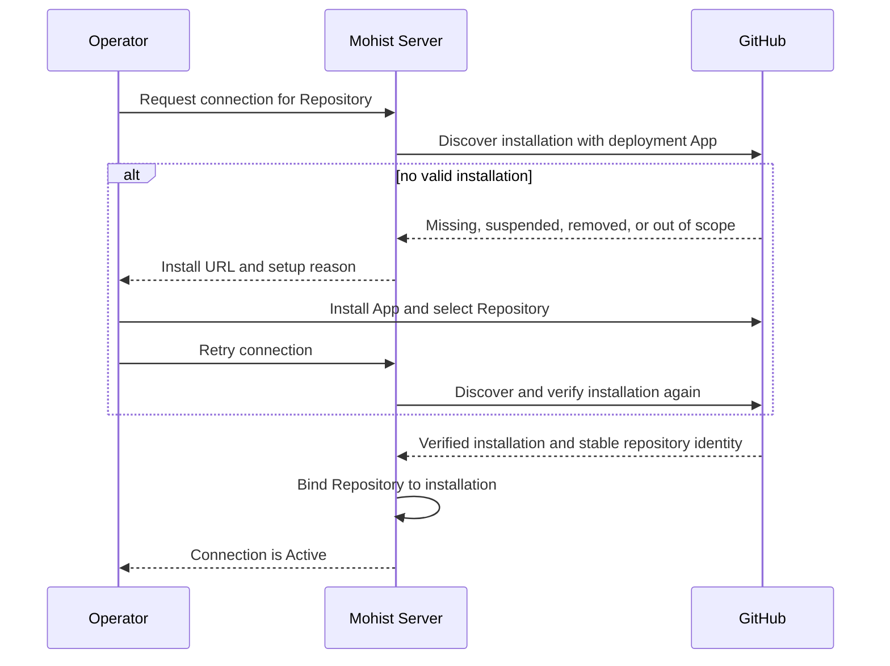
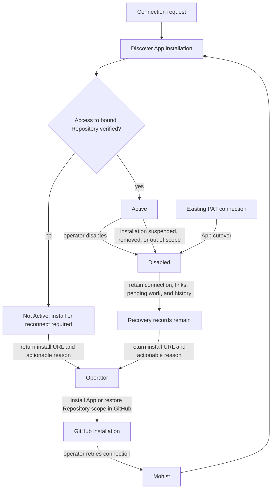
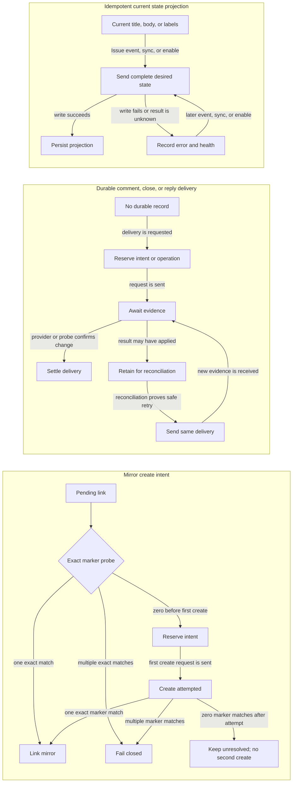
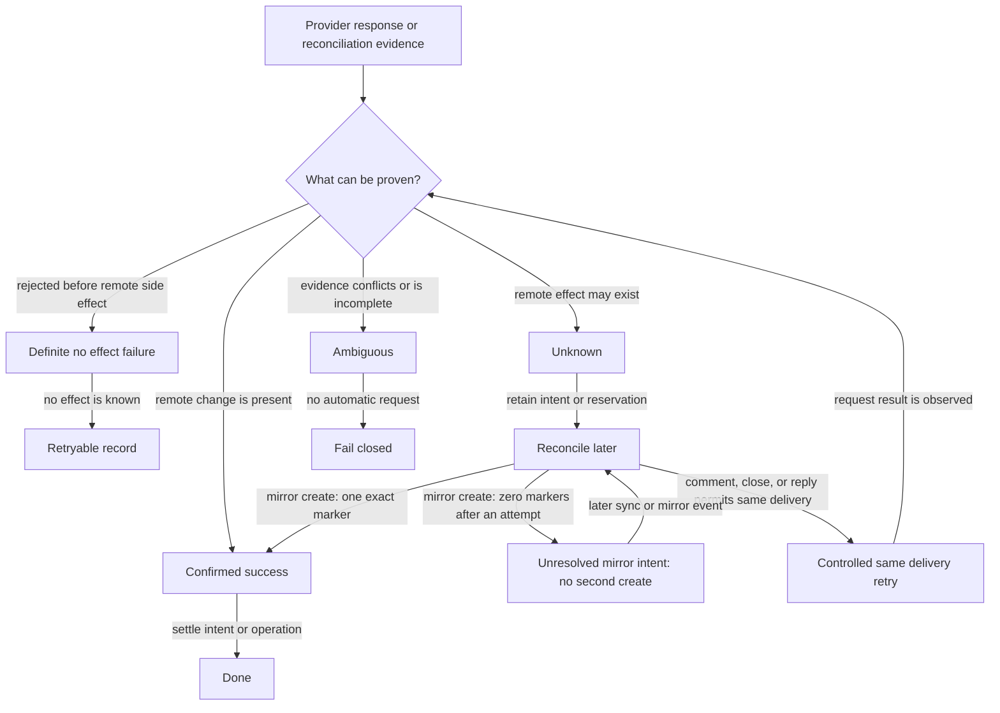
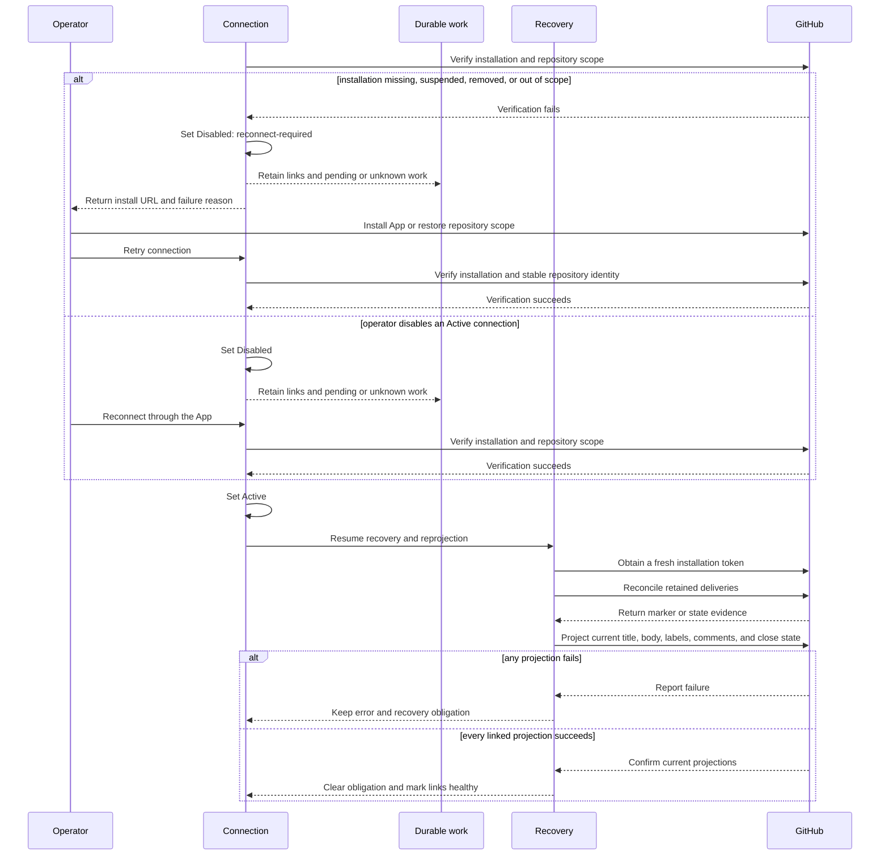

# GitHub Integration

GitHub integration makes a connected GitHub repository the public mirror of a
Project's Issues and the imperative entry point for handing work to Mohist.
This document defines component boundaries and the decisions that keep the
integration reliable. See [`docs/github.md`](../docs/github.md) for product
behavior. The PR delivery Action family is defined in
[`workflow/actions.md`](workflow/actions.md) and
[`docs/actions/github-pr.md`](../docs/actions/github-pr.md) and is not repeated
here.

## Design Drivers

A long-lived PAT makes a connection depend on a human credential and does not
identify the GitHub installation that grants repository access. The target
contract gives the deployment one App identity, then scopes each connection to
one verified installation and one stable repository identity.

The design must preserve four boundaries:

- The deployment owns the App credential. A Project connection owns only its
  verified installation binding and repository policy.
- GitHub installation access can change after setup. Readiness therefore comes
  from verification, not from the presence of stored coordinates.
- Installation tokens are short-lived. Token expiry must be recoverable without
  changing mirror identity or exposing a new operator credential.
- Existing mirror links and durable outbound work must survive disable and
  reconnect. Unknown outcomes continue to use the existing reconciliation
  contract.

The existing per-connection signed Repository webhook remains the inbound
boundary. A GitHub App global webhook would create a second ingress authority
and is outside this design. Runner `gh` authentication remains a separate
credential boundary because Runner git and Pull Request operations have a
different owner and lifecycle.

## Model

### Deployment GitHub App

A Mohist deployment owns exactly one GitHub App credential. The App ID, slug,
and protected private-key file are deployment configuration. Only the Server
GitHub integration reads them. The CLI, Web client, Project Repository
configuration, connection response, and Runner never receive the private key.

The App credential authenticates installation discovery and short-lived
installation-token minting. It does not replace the signed secret on the
existing per-connection Repository webhook, and it does not replace Runner's
host-local `gh` credential.

### GitHubInstallation

A GitHub installation is GitHub's authorization of the deployment's App for one
account and its selected repositories. Mohist discovers an installation for a
requested Repository and verifies access before binding it to a connection. The
installation is owned by GitHub; the connection stores only its verified
installation identity and access facts.

### GitHubConnection

A Project-scoped resource in the GitHub integration supporting context, placed
like Slack integration; see [`domain-analysis.md`](domain-analysis.md). It
declares which GitHub repository mirrors which Project Repository under which
policy and owns no execution state.

A connection contains the bound Repository resource name, current GitHub
coordinates (`Owner`, `Repo`), the repository's stable GitHub identity, the
verified installation identity, an optional Approvers list for Pull Request
review decisions, and `Active` or `Disabled` status. `(Owner, Repo)` is unique
across the Server, and a Repository has at most one connection, so an Issue's
target repository unambiguously determines its mirror location. The stable
repository identity is authoritative when owner or repository name changes.

The connection never stores an App private key, installation token, or operator
PAT. Its per-connection signed webhook secret remains a separate Server secret.
A short-lived installation token is obtained only for an outbound GitHub API
operation and is never exposed by connection reads. Direct Server calls to the
GitHub API are limited to Issue and comment operations; git content operations
remain Runner-side through its separate `gh` credential.

### GitHubIssueLink

A Server infrastructure integration record — analogous to a Slack conversation
mapping, not an aggregate fact — mapping a Mohist Issue to its GitHub mirror
one-to-one. It stores the GitHub Issue's stable node id alongside its current
coordinates, carries separate bookkeeping for pending mirror creation,
delivered comments and closes, and the current state label, and reports sync
health: healthy, or the last synchronization error.

The link identifies the pair and scopes its mirror bookkeeping. Durable
non-idempotent deliveries use their own intent or operation records; title/body
and state-label projection use current-state replacement. The link is created
exactly once per pair — at mirror creation, at `/mohist start`, or at manual
`link` — and survives disable/enable cycles of its connection.

### WorkflowRun Pull Request Identity

WorkflowRun owns one write-once Pull Request identity: its already-bound
Repository and the Pull Request number. The identity is recorded when the
create-or-reuse Pull Request operation first succeeds. Replaying that operation
with the same identity is idempotent; a conflicting Pull Request number is
rejected. This identity is part of WorkflowRun state, not a new resource or DSL
construct, and it is the authority for GitHub review correlation. The Profile may
pass `vars.github.pr.number` to Action inputs and retain `vars.github.pr.url` for
presentation, but those Variables are not identity and cannot establish or change
it. Before dispatch, WorkflowRun rejects a Pull Request number that conflicts with
the identity. The Pull Request Review Translator reads the immutable identity.

## The Direction Contract

The two directions are asymmetric by design:

- **Mohist to GitHub is passive projection.** Issue domain events drive
  mirroring without any user request.
- **GitHub to Mohist is imperative.** The only entry that creates Mohist state
  from GitHub is a command comment. Everything else inbound either maintains an
  existing link (edit sync, lifecycle events) or feeds event routing.

## Setup and Readiness

The operator starts a connection for a registered Project Repository and its
GitHub repository. The Server authenticates discovery with the deployment's one
App credential and automatically finds the installation that can authorize the
repository. The operator does not provide a PAT, App private key, or installation
token.

If discovery finds no valid installation, Mohist does not mark the connection
`Active`. It returns the App installation URL and the reason that setup cannot
continue. The operator installs the App and selects the repository in GitHub,
then retries. Mohist verifies installation access and records the installation
identity and stable repository identity before marking the connection `Active`.

The existing signed Repository webhook remains configured per connection. Its
secret is verified at ingress and is independent of the App credential. The App
does not add a global webhook endpoint. The App installation requires Issues
read/write, Pull Requests read, and the GitHub-provided Metadata read access.

## Connection Lifecycle

`Active` means that installation verification succeeded for the bound
Repository. `Disabled` pauses outbound projection and retains all links and
pending durable work. Mohist uses `Disabled` with reconnect-required status when
GitHub suspends or removes the installation, or when the installation no longer
includes the bound Repository. An operator disable uses the same pause and
retention boundary. Connection deletion is unsupported. Disable and reconnect
preserve the connection, links, pending durable work, and history.

Existing PAT-backed connections are moved to `Disabled` with reconnect-required
status. Reconnection discovers and verifies the App installation. Mohist does
not convert the PAT, use it as a fallback, or delete the connection's links and
pending work.

## Installation Token Semantics

For an outbound GitHub API operation, the Server uses the Active connection's
verified installation to obtain a short-lived installation token. GitHub's
reported expiration bounds any local cache; an expired token is discarded and
replaced. The token never becomes a connection field and is never returned to
the operator, CLI, Web client, or Runner.

If a token expires before a request is sent, the Server obtains one fresh token
and sends the request. If a response may have applied remotely, the existing
unknown-outcome reconciliation contract runs before any repeat. Token refresh
must not create a second mirror, comment, close, or reply delivery.

Runner git and Pull Request operations continue to use the Runner host's
separate `gh` authentication. The Server's installation token cannot authorize
Runner work, and Runner `gh` authentication cannot configure a Server GitHub
connection.

## Inbound

`POST /api/github-connections/{connectionId}/ingress` remains the per-connection
signed Repository webhook boundary. It verifies `X-Hub-Signature-256` over the
raw body, normalizes the event into `IEventStore`, and returns; all processing is
asynchronous and every consumer is idempotent, because GitHub delivery is at
least once and may be out of order. A GitHub App global webhook is not accepted.
The normalized event set grows to cover the command entry and content sync:
issue comments, issue edits, closure and reopening, Pull Request reviews, and
check results. Payloads are preserved unchanged as evidence; lineage stamps
follow the existing rules.

### Command Translator

A durable handler subscribes to issue-comment events. A comment whose body
starts with `/mohist` from an author GitHub reports as owner, member, or
collaborator is a command; everything else is ignored. The translator shares
its verb vocabulary with `mo` — a GitHub-side verb names the same domain
action as the CLI verb, with comment replies in place of flags and JSON.

`start` creates the Mohist Issue from the GitHub title and body (the creating
side owns initial content), maps `p0`–`p4` labels to priority, writes the link,
and starts the Workflow with the Project's default Profile. The unique
constraint on the link makes a repeated command a no-op that replies with the
existing Issue. Refusals — an unavailable Repository, an unknown verb — are
answered with one reply comment. The translator is deterministic
configuration-driven code; no Agent or prompt participates in parsing or
permission.

### Pull Request Review Translator

No separate GitHub review entity is introduced. When the built-in GitHub PR
Workflow creates or reuses the Pull Request, the WorkflowRun records its
already-bound Repository and Pull Request number in the write-once Pull Request
identity. A same-identity replay is idempotent; a conflicting Pull Request
number is rejected. Review translation reads this immutable identity rather than
branch names, mutable Run Variables, or a Pull Request URL. Profile Actions may
still receive `vars.github.pr.number` as an explicit carrier, and the Profile may
retain `vars.github.pr.url` for presentation. These Variables do not establish or
change the identity, and WorkflowRun rejects a conflicting number before dispatch.

GitHub reviews decide only the Check Approval Point. The translator maps GitHub
**Approve** to Approve and GitHub **Request changes** to Request Changes with the
review body as Approval Feedback when that action is available. Plan and custom
Approval Points use ordinary Mohist decision surfaces. WorkflowRun validates
that it still waits at Check Approval and that Request Changes is available from
its bound Definition. The translator owns only this provider mapping; WorkflowRun
owns Approval Point state and Feedback Task execution. Detailed durable routing
mechanics remain a separate integration concern.

### Edit Translator

Issue-edited events on a linked pair synchronize title and body into Mohist.
The guard is content equality: an inbound edit matching the current Mohist
value is the echo of Mohist's own outbound write and is dropped. A real edit
updates the Issue record and is attributed to `github:<login>` in the timeline.
It does not retroactively change the input of a Workflow already running — the
new content takes effect at the next planning or review point.

### Lifecycle Translator

Close and reopen events apply the product rules in
[`docs/github.md`](../docs/github.md#linked-pairs), with two reliability
guards:

- **Terminal check.** Mohist makes an Issue terminal before write-back closes
  the mirror, so the returned closed event is a no-op without identifying the
  actor.
- **Integrate guard.** A close event arriving while the Issue's Run is at or
  past the Integrate stage is a delivery echo — most importantly the automatic
  close triggered by merging a linked Pull Request — and is ignored. Withdrawal
  by closing is only possible before delivery begins.

## Outbound: the Mirror Adapter

Handlers subscribe to Issue and Workflow events and maintain the mirror through
the Active connection's verified installation identity. Each outbound GitHub
request obtains a short-lived installation token under the token contract above:

- **Mirror creation.** A non-Draft Issue whose target repository is connected
  gets a GitHub mirror. The mirror has no visible tracking footer, and the
  confirmation comment links it back to Mohist.
- **Content sync.** Title and body edits project outward. Content equality
  suppresses the returning echo.
- **Progress projection.** The mutually exclusive `mohist:*` state labels and
  the four milestone comment classes project Workflow progress.
- **Finalization.** Completion closes the mirror as completed. Cancellation
  closes it as not planned.

Mohist never places GitHub closing keywords in Pull Request bodies, so delivery
cannot close the mirror early. Durable operation, retry, reconciliation, and
fencing rules are defined in [Durable Outbound Operations](#durable-outbound-operations).

## Durable Outbound Operations

Durable tracking is required when replaying a request could create a duplicate.
Mirror creation uses pending link intent and an invisible marker; milestone
comments and closes use `GitHubIssueCommentOperation`; command replies use a
separate reply ledger. Title/body and `mohist:*` label writes use idempotent
current-state replacement and can be re-projected after an error. Marker
reconciliation searches GitHub Issues in all states.

### Outcome certainty

### Recovery after disable or reconnect

A disabled connection does not release its mirror link or discard durable work.
Recovery first restores a verified installation, then reconciles retained
operations and projects the current state. A failed projection keeps the link
unhealthy and the work durable.

### Invariants

- **Fencing.** Durable comment/close recovery carries the operation ID and
  GitHub Issue number. Stale recovery cannot settle or delete another target's
  reservation. Current-state writes use replacement semantics, not this fence.
- **Reset and 404.** Only a 404 from the exact mirror content endpoint for the
  current target can reset and replace a mirror. A 404 from comment, label,
  close, or Pull Request endpoints cannot reset it.
- **Health.** A link is healthy only after current projection succeeds. Disabled
  work remains durable; enable resumes recovery. Errors remain visible until a
  later successful projection clears them.

### Required evidence

- Mirror create: first-attempt zero/one/multiple marker matches, no-effect
  rejection, unusable response, and proof that zero after an attempt never
  sends another create.
- Durable delivery: reserve-before-send, duplicate delivery, comment/close
  state reconciliation, reply recovery, and proof that unknown results are not
  blindly resent.
- Current-state projection: title/body replacement, echo suppression,
  state-label replacement and preservation, durable error/health, and later
  reprojection.
- Recovery safety: stale target, endpoint-specific 404, Disabled retention,
  restart recovery, and complete enable reprojection.

## Failure Model

An outbound failure records the error on the link and surfaces it in CLI and
Web. It never blocks the Workflow or rolls back Mohist Issue state. The
`mo issue github sync` command is the operator repair path for a missing or
failed mirror. All retry, reconciliation, fencing, pause, reset, and health
rules are defined in [Durable Outbound Operations](#durable-outbound-operations).

## Non-goals

- GitHub OAuth user tokens or device flow.
- Web connection management UI.
- Multiple GitHub App configurations in one Mohist deployment.
- GitHub App global webhook ingress.
- Replacement of Runner `gh` authentication.
- Automatic conversion of a PAT into an App installation.

## Status

The one-deployment GitHub App contract is implemented. Verified installation
binding, short-lived installation tokens, token refresh, one-401 recovery,
PAT cutover, connection recovery, and the existing #770–#775 GitHub native
behavior use the App identity. The App credential is deployment-owned and is
not exposed to CLI, Web, Repository configuration, or connection reads.

Remaining limitations are GitHub user-level OAuth, multiple App configurations,
GitHub Enterprise Server, global App webhooks, and Runner `gh` authentication.
