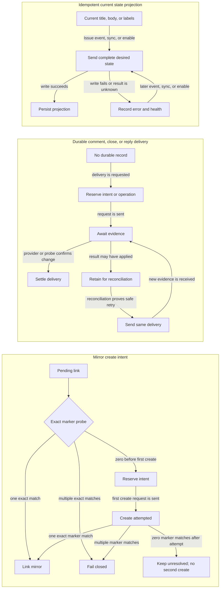
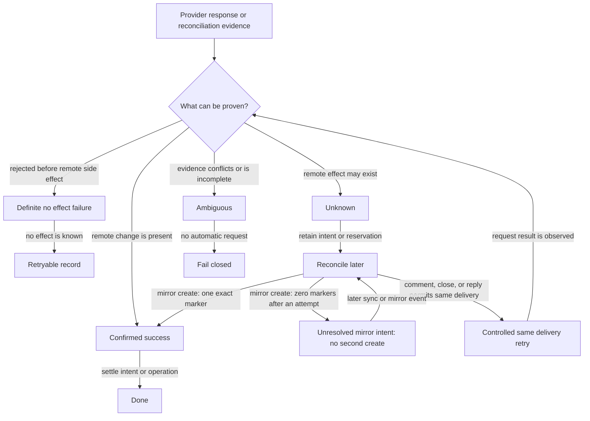

# GitHub Integration

GitHub integration makes a connected GitHub repository the public mirror of a
Project's Issues and the imperative entry point for handing work to Mohist.
This document defines component boundaries and the decisions that keep the
integration reliable. See [`docs/github.md`](../docs/github.md) for product
behavior. The PR delivery Action family is defined in
[`workflow/actions.md`](workflow/actions.md) and
[`docs/actions/github-pr.md`](../docs/actions/github-pr.md) and is not repeated
here.

## Model

### GitHubConnection

A Project-scoped resource in the GitHub integration supporting context, placed
like Slack integration; see [`domain-analysis.md`](domain-analysis.md). It
declares which GitHub repository mirrors which Project Repository under which
policy and owns no execution state.

A connection declares the GitHub coordinates (`Owner`, `Repo`, plus the
repository's stable node id so a rename or transfer can be detected), the bound
Repository resource name, an optional Approvers list for review Approval, and
`Active` or `Disabled` status. `(Owner, Repo)` is unique across the Server, and
a Repository has at most one connection, so an Issue's target repository
unambiguously determines its mirror location.

Credentials stay out of the connection record and follow the existing
[`ISecretStore`](../packages/server/src/Mohist.Server/Infrastructure/Security/Secrets/ISecretStore.cs)
boundaries: an inbound signature secret and, for the current connection API, a
required fine-grained PAT with Issues read and write only. The Server stores the
PAT as a secret and never exposes it in connection reads. GitHub App
installation-token exchange is not implemented yet. Direct Server calls to the
GitHub API are limited to Issue and comment operations; git content operations
remain Runner-side through delivery-token issuance.

### GitHubIssueLink

A Server infrastructure integration record — analogous to a Slack conversation
mapping, not an aggregate fact — mapping a Mohist Issue to its GitHub mirror
one-to-one. It stores the GitHub Issue's stable node id alongside its current
coordinates, carries separate bookkeeping for pending mirror creation,
delivered comments and closes, and the current state label, and reports sync
health: healthy, or the last synchronization error.

The link identifies the pair and scopes its mirror bookkeeping. Durable
non-idempotent deliveries use their own intent or operation records; title/body
and state-label projection use current-state replacement. The link is created
exactly once per pair — at mirror creation, at `/mohist start`, or at manual
`link` — and survives disable/enable cycles of its connection.

## The Direction Contract

The two directions are asymmetric by design:

- **Mohist to GitHub is passive projection.** Issue domain events drive
  mirroring without any user request.
- **GitHub to Mohist is imperative.** The only entry that creates Mohist state
  from GitHub is a command comment. Everything else inbound either maintains an
  existing link (edit sync, lifecycle events) or feeds event routing.

## Inbound

`POST /api/github-connections/{connectionId}/ingress` verifies
`X-Hub-Signature-256` over the raw body, normalizes the event into
`IEventStore`, and returns; all processing is asynchronous and every consumer
is idempotent, because GitHub delivery is at least once and may be out of
order. The normalized event set grows to cover the command entry and content
sync: issue comments, issue edits, closure and reopening, Pull Request reviews,
and check results. Payloads are preserved unchanged as evidence; lineage stamps
follow the existing rules.

### Command Translator

A durable handler subscribes to issue-comment events. A comment whose body
starts with `/mohist` from an author GitHub reports as owner, member, or
collaborator is a command; everything else is ignored. The translator shares
its verb vocabulary with `mo` — a GitHub-side verb names the same domain
action as the CLI verb, with comment replies in place of flags and JSON.

`start` creates the Mohist Issue from the GitHub title and body (the creating
side owns initial content), maps `p0`–`p4` labels to priority, writes the link,
and starts the Workflow with the Project's default Profile. The unique
constraint on the link makes a repeated command a no-op that replies with the
existing Issue. Refusals — an unavailable Repository, an unknown verb — are
answered with one reply comment. The translator is deterministic
configuration-driven code; no Agent or prompt participates in parsing or
permission.

### Edit Translator

Issue-edited events on a linked pair synchronize title and body into Mohist.
The guard is content equality: an inbound edit matching the current Mohist
value is the echo of Mohist's own outbound write and is dropped. A real edit
updates the Issue record and is attributed to `github:<login>` in the timeline.
It does not retroactively change the input of a Workflow already running — the
new content takes effect at the next planning or review point.

### Lifecycle Translator

Close and reopen events apply the product rules in
[`docs/github.md`](../docs/github.md#linked-pairs), with two reliability
guards:

- **Terminal check.** Mohist makes an Issue terminal before write-back closes
  the mirror, so the returned closed event is a no-op without identifying the
  actor.
- **Integrate guard.** A close event arriving while the Issue's Run is at or
  past the Integrate stage is a delivery echo — most importantly the automatic
  close triggered by merging a linked Pull Request — and is ignored. Withdrawal
  by closing is only possible before delivery begins.

## Outbound: the Mirror Adapter

Handlers subscribe to Issue and Workflow events and maintain the mirror through
the connection identity:

- **Mirror creation.** A non-Draft Issue whose target repository is connected
  gets a GitHub mirror. The mirror has no visible tracking footer, and the
  confirmation comment links it back to Mohist.
- **Content sync.** Title and body edits project outward. Content equality
  suppresses the returning echo.
- **Progress projection.** The mutually exclusive `mohist:*` state labels and
  the four milestone comment classes project Workflow progress.
- **Finalization.** Completion closes the mirror as completed. Cancellation
  closes it as not planned.

Mohist never places GitHub closing keywords in Pull Request bodies, so delivery
cannot close the mirror early. Durable operation, retry, reconciliation, and
fencing rules are defined in [Durable Outbound Operations](#durable-outbound-operations).

## Durable Outbound Operations

Durable tracking is required when replaying a request could create a duplicate.
Mirror creation uses pending link intent and an invisible marker; milestone
comments and closes use `GitHubIssueCommentOperation`; command replies use a
separate reply ledger. Title/body and `mohist:*` label writes use idempotent
current-state replacement and can be re-projected after an error. Marker
reconciliation searches GitHub Issues in all states.



### Outcome certainty



### Disable and enable

```mermaid
sequenceDiagram
    participant C as Connection
    participant W as Durable work
    participant R as Recovery
    participant G as GitHub

    C->>C: becomes Disabled
    C-->>W: pause claims; retain pending and unknown work
    Note over C,W: Sent requests may settle only for the current target
    C->>C: becomes Active
    C->>R: resume recovery and record reprojection obligation
    R->>G: reconcile retained deliveries
    G-->>R: return marker or state evidence
    R->>G: project current title, body, labels, comments, and close state
    alt any projection fails
        G-->>R: report failure
        R-->>C: keep error and obligation
    else every linked projection succeeds
        G-->>R: confirm all current projections
        R-->>C: clear obligation; mark links healthy
    end
```

### Invariants

- **Fencing.** Durable comment/close recovery carries the operation ID and
  GitHub Issue number. Stale recovery cannot settle or delete another target's
  reservation. Current-state writes use replacement semantics, not this fence.
- **Reset and 404.** Only a 404 from the exact mirror content endpoint for the
  current target can reset and replace a mirror. A 404 from comment, label,
  close, or Pull Request endpoints cannot reset it.
- **Health.** A link is healthy only after current projection succeeds. Disabled
  work remains durable; enable resumes recovery. Errors remain visible until a
  later successful projection clears them.

### Required evidence

- Mirror create: first-attempt zero/one/multiple marker matches, no-effect
  rejection, unusable response, and proof that zero after an attempt never
  sends another create.
- Durable delivery: reserve-before-send, duplicate delivery, comment/close
  state reconciliation, reply recovery, and proof that unknown results are not
  blindly resent.
- Current-state projection: title/body replacement, echo suppression,
  state-label replacement and preservation, durable error/health, and later
  reprojection.
- Recovery safety: stale target, endpoint-specific 404, Disabled retention,
  restart recovery, and complete enable reprojection.

## Failure Model

An outbound failure records the error on the link and surfaces it in CLI and
Web. It never blocks the Workflow or rolls back Mohist Issue state. The
`mo issue github sync` command is the operator repair path for a missing or
failed mirror. All retry, reconciliation, fencing, pause, reset, and health
rules are defined in [Durable Outbound Operations](#durable-outbound-operations).

## Status

Implemented today: #770 no-Workflow Issue lifecycle, #771 GitHub mirror
visibility in the Issue read models, CLI, and Web, #772 automatic ready-only
mirroring with durable Pending intent, invisible marker reconciliation, and
two-way title/body sync with equality echo suppression, #773 `/mohist start`
command intake with GitHub permission gating, p0-p4 priority mapping,
idempotent link creation, durable command replies, refusal replies, and
reliable command reply recovery, #774 linked lifecycle translation with the
Integrate delivery-echo guard, and #775 reconcile-based recovery. Signed
ingress and normalization, close withdrawal, Pull Request review Approval,
and best-effort write-back with durable failure records are included. No-Workflow
closes honor GitHub's `completed` versus `not_planned` reason, cancelled Issues
reopen to backlog, and completed Issues remain terminal with one follow-up
suggestion. The built-in GitHub PR path omits closing keywords from PR bodies;
terminal write-back still closes mirrors. GitHub links persist healthy/error sync
health and the last error; issue-scoped `sync`, `link`, and `unlink` operations
reconcile or pair mirrors, and connection disable/enable pauses translation and
reprojects existing links. New feed-created Issues no longer emit the
`github-issue` origin label; historical feed-created links may retain it as
data. Connection creation uses a fine-grained PAT with Issues read/write.
Connection configuration contains only Repository binding, identity, and
Approvers.

The remaining gap is GitHub App identity and installation-token exchange.
