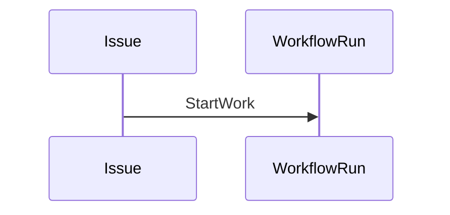
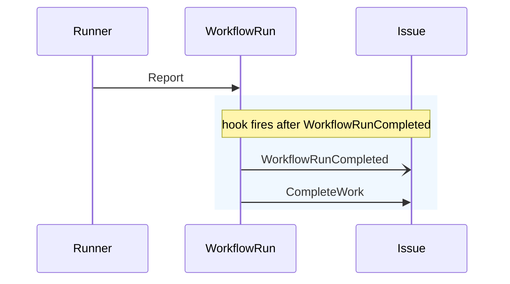
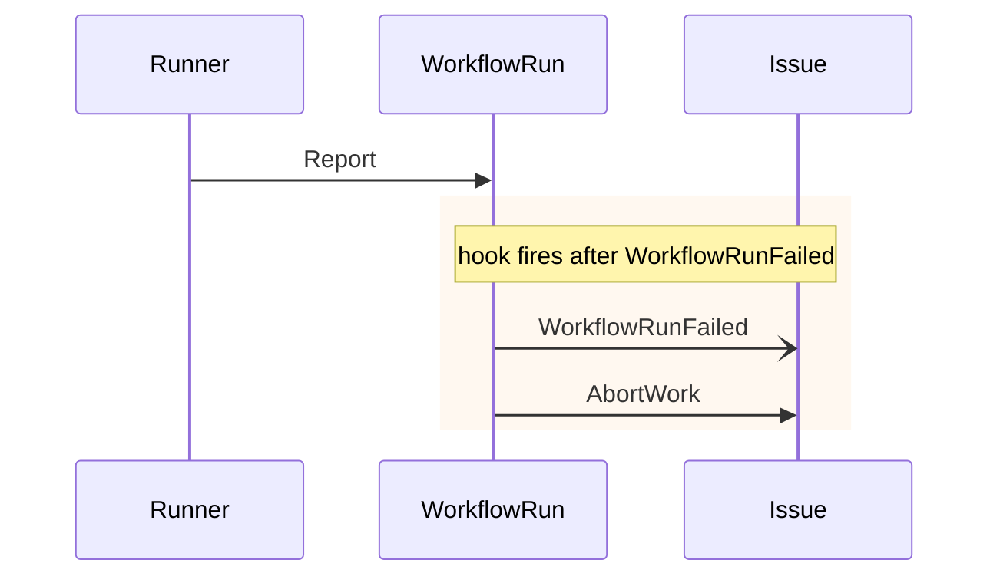
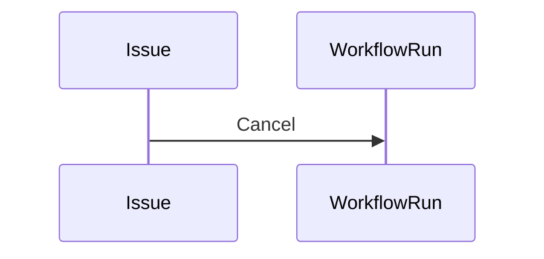
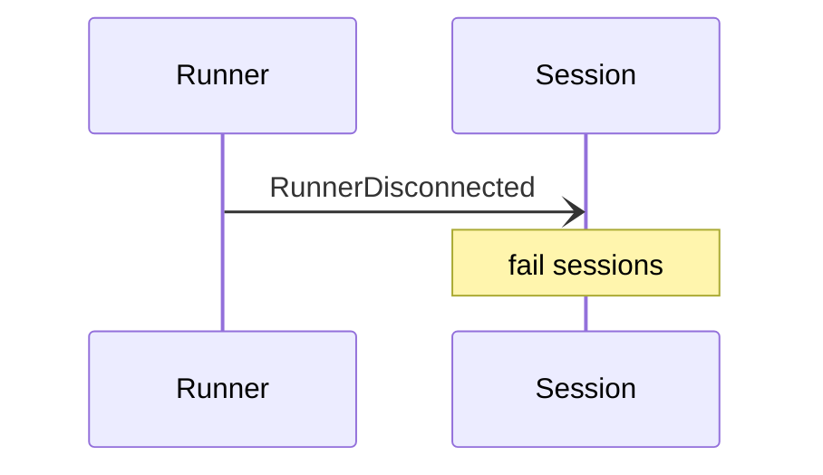

# Aggregate Coordination

## Conventions

- Aggregates: `Issue` / `WorkflowRun` / `Runner` / `Session`
- Solid arrow `->>`: command (synchronous cross-aggregate call)
- Open arrow `-)` : event (triggers a downstream command)
- Single-aggregate transitions are listed in prose, not drawn

## 跨聚合事件→命令

| 事件 | 发送方 | 触发的命令 | 接收方 |
|---|---|---|---|
| `WorkflowRunCompleted` | WorkflowRun | `CompleteWork` | Issue |
| `WorkflowRunFailed` | WorkflowRun | `AbortWork` | Issue |
| `RunnerDisconnected` | Runner | (无 — Session 自决) | Session |

## Start



## Report (成功)



## Report (失败)



## Stop (issue 在跑 workflow)



## Runner Disconnect



## 单一聚合 transition

```text
WorkflowRun 内部: Pause / Resume / Approve / Reject / Retry / Rerun
Issue 内部:      Archive / Unarchive / Reopen / Close
Runner 内部:     Register / Unregister / Heartbeat
```
