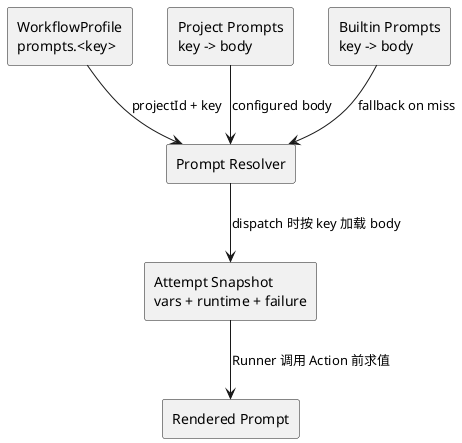

# Prompt Management

Prompt 是 Project-scoped 资源，属于 Project Space。WorkflowProfile、Issue 和 WorkflowRun
都不拥有 Prompt，也不保存 Prompt override。

一个 Project 按 key 管理自己的 Prompt。Builtin `.prompt` 文件只在 Project 未配置该 key
时提供只读 fallback，不是另一个可配置 scope。

Workflow 是 Prompt 的一个消费者；Standalone Agent 使用同一个 Project Prompt 集合。

## Resolution

WorkflowProfile 只保存 Prompt key 引用，例如 `${{ prompts.proposal }}`，不保存 Prompt
body。Server 在 dispatch 时按 Project 和 key 把 body 加载进 attempt 不可变快照，Runner
在调用 Action 前的执行入口对快照中的 body 做模板求值：



```text
resolvePrompt(projectId, key):
  if Project configured key:
    return Project Prompt body

  return Builtin Prompt body for key
```

Prompt 不做跨 scope merge，也不产生 `EffectivePrompts` collection。同名 Prompt body 是
一个完整字符串；Project 配置整体替换 builtin body。

Profile 写入时可以校验 Prompt key 的语法。Server 在 dispatch 时按 Project Prompt 或
builtin fallback 加载 body；都不存在该 key 时本次 dispatch 失败并返回可行动的领域错误。
同一次 attempt 的 Prompt body 由 dispatch 时刻的快照冻结，后续修改不影响该 attempt。

## Rendering

```text
PromptTemplateEngine.Render(body, attemptSnapshot)
  ${{ path.to.value }} -> attempt snapshot lookup
```

渲染使用 attempt 快照里的 Effective Stage Variables 与 runtime context，与 `with` /
`expect` 共享同一套模板表达式语法：根命名空间封闭；任一表达式解析不出值时本次 task
失败；嵌入字符串的值必须是 scalar，对象或数组会失败；表达式占据整个值时保留 JSON 类型；
`\${{` 产生字面 `${{`。递归展开必须有确定的深度上限。渲染时机与 attempt 快照语义以
[`workflow/task-dispatch.md`](workflow/task-dispatch.md) 为权威。

Prompt 不保存 revision 或 body snapshot。每次 dispatch 都从当时的 Project Prompt 资源
读取最新 body 并冻结进 attempt 快照；redelivery、retry、rerun-from-stage 都基于自己的
快照重新读取并渲染，因此一次 attempt 使用的 Prompt body 与该 attempt 的 dispatch 时刻
绑定。Action 收到渲染后的 Prompt 后，本次 Action 调用不再读取 Prompt resource。

Workflow 只依赖 Prompt key。Action 最终接收渲染后的 Prompt text，不能再次读取 Prompt
resource 或 Variables resource。

## Builtin Prompt 约定

Builtin `.prompt` 是产品化内容，随产品分发、面向任意项目：

- 一律使用英文。
- 保持产品与技术栈通用：不引用 Mohist 仓库自身的命令面、目录结构或开发历史示例。
- 可以引用 Mohist 产品面（`mo` CLI、文档列出的模板命名空间、workflow 变量），它们在
  任意受管项目中都成立。OpenSpec 路径约定直接写成
  `openspec/changes/issue-${{ issue.number }}`，不依赖额外命名空间。
- 只声明任务、输入输出与机器可校验的契约（产出路径、marker）；不规定过程细节、问题
  分类或报告模板——执行者是足够聪明的 agent，报告的读者主要是下一个任务的 agent。
- review 类 prompt 只诊断不修复；修复由独立的 fix 类 prompt 承担，review 报告是两者
  之间的交接面。
- 修改文件的 prompt（build、fix 类）常驻一行中断契约：agent 可能随时被中断——边做
  边提交、进度记录保持最新。review 类 prompt 不加：其唯一产物是报告，收到收尾警告
  时用当前发现立即写完即可。期限警告的注入与文案由 runtime 统一负责（见
  [`runtimes/opencode.md`](runtimes/opencode.md)「回合期限与两段式收尾」），prompt
  不复述警告内容。

CLI skill-data 中随 nupkg 分发的 SKILL.md 适用同一约定。

## API

Prompt collection 直接挂在 Project 下：

```text
GET    /api/projects/{projectRef}/prompts
GET    /api/projects/{projectRef}/prompts/{key}
PUT    /api/projects/{projectRef}/prompts/{key}
DELETE /api/projects/{projectRef}/prompts/{key}
POST   /api/projects/{projectRef}/prompts/{key}/preview
```

删除 Project Prompt 后，该 key 恢复使用 builtin fallback；不存在 builtin 时读取失败。
Issue 和 WorkflowRun 不提供 Prompt API。

## Status

与当前实现的差距：

- 当前 Project Prompt 同时暴露 `/templates`、`/workflow-profile/prompts` 等重复路径；目标
  只保留 Project `/prompts` resource。
- 当前部分 Profile 解析代码会预先组装 Prompt map；目标实现只传 key，并在执行时读取
  单个 Project Prompt。
