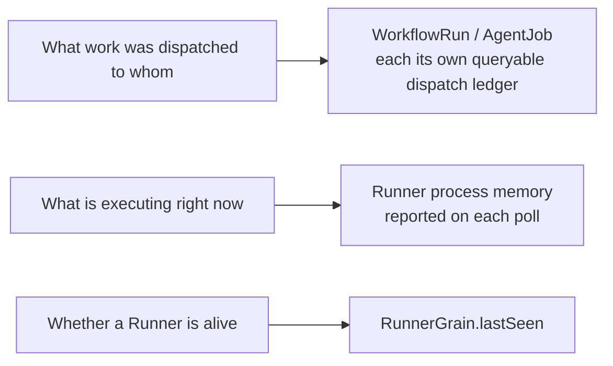
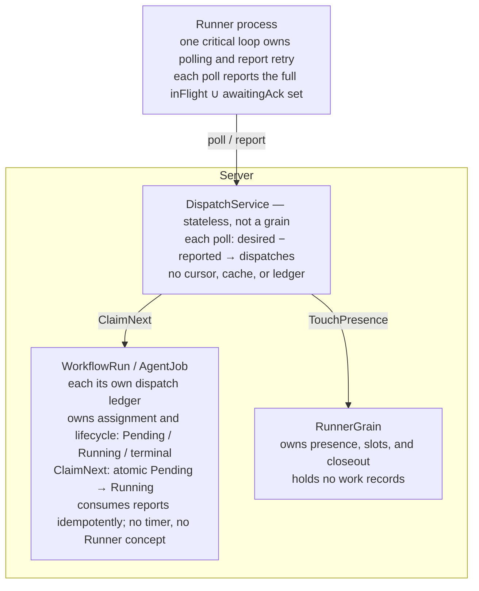
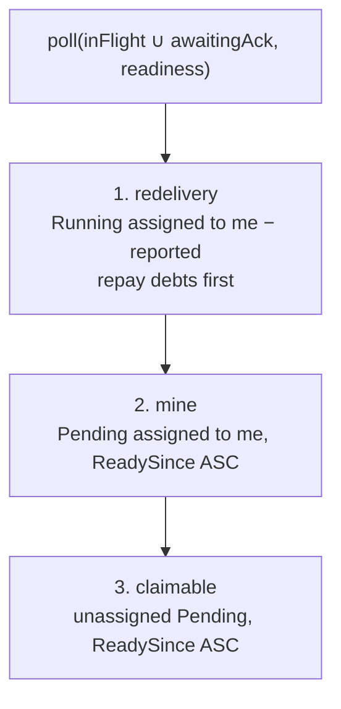
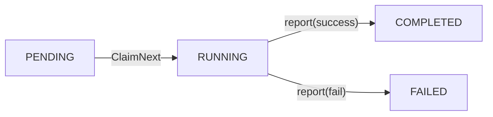
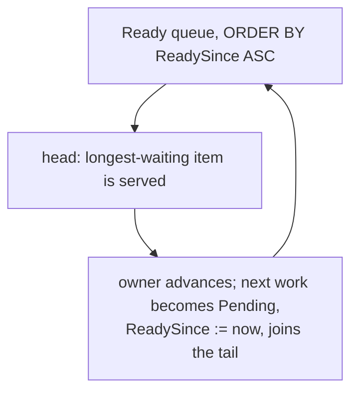
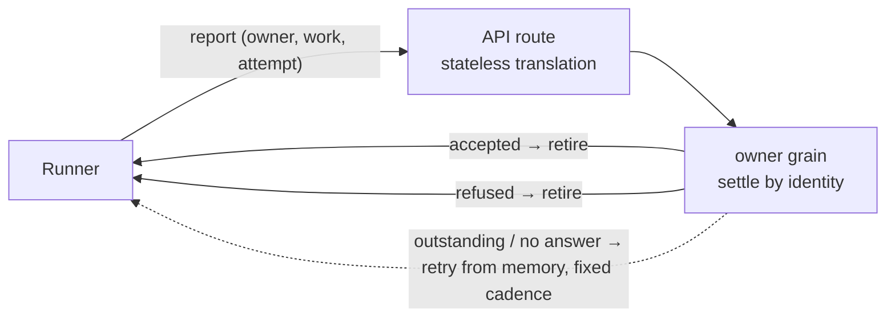
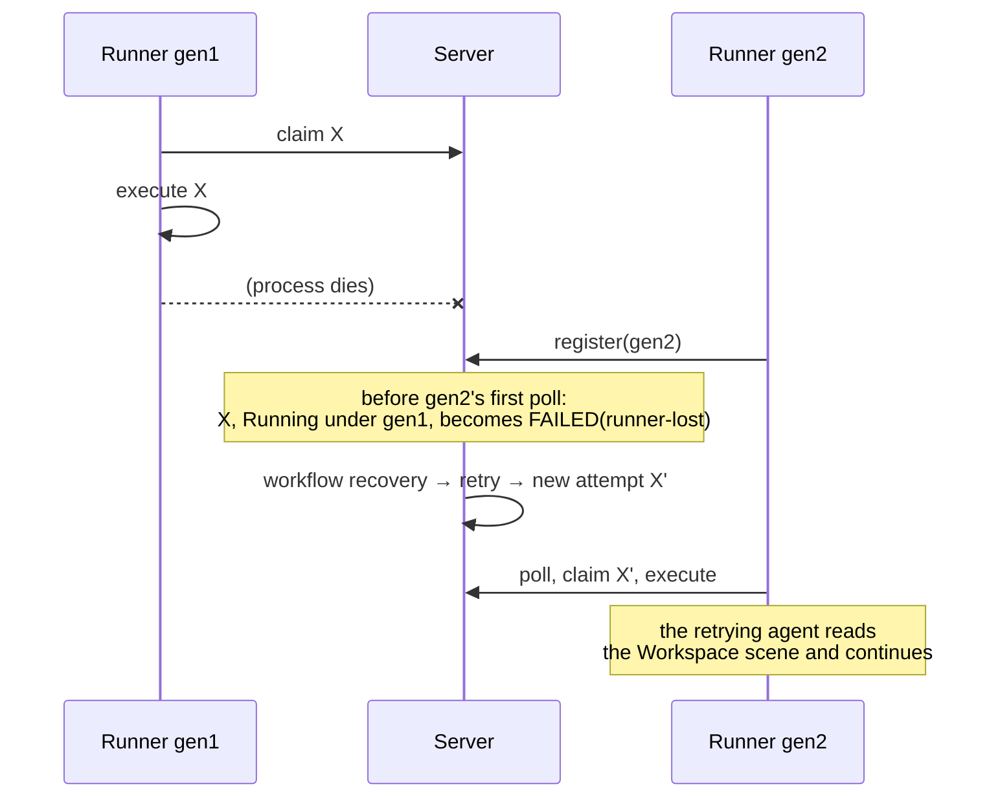

# Runner and Dispatch

Dispatch is memoryless: every decision is a stateless query over persisted
state. A Runner's self-report is used only to discover work that needs
redelivery. It is not authoritative; authority is always reconstructed from the
current store contents.

Every fact has exactly one owner:



There is no second copy. No component stages dispatch or work state owned by
another owner; it reconstructs that state from the owner's persisted state when
needed. Dispatch coordination therefore needs no reconciliation because there
is no duplicate fact to reconcile.

Invariants:

```text literal
Every WorkflowRun / AgentJob is its own dispatch ledger.
Running => corrected within one poll as:
           reported | re-dispatched | rejected as invalid | closed out
count(Running work assigned to Runner) <= slots, checked at claim time
```

## Runner Aggregate and Presence

Presence facts follow one lifecycle rule: persistent fields (`slots`) change
only through the control plane and are never invalidated by traffic; snapshot
fields (`lastSeen`, RunnerInfo) are replaced as a whole on register, poll, or
heartbeat-repair, and cleared on unregister.

A Runner holds no work records. Work records fail the ownership test: the
slot invariant is not owned by the Runner, the running-work set can be derived
by querying both owner stores (`Pending/Running WHERE AssignedRunnerId=R`),
and no Runner behavior accepts a work record. Runtime state reads are derived
the same way — assembled from the owner stores, never stored.

## Dispatch Protocol: Claim / Pull / Report



### Transport

All work, both Workflow and AgentJob, is pull-only: DispatchService computes it
on poll, and reports go directly to the owner grain. The poll is also the
presence heartbeat (`TouchPresence`). Info travels only through register,
unregister, and heartbeat-repair; a poll never updates it.

The target Server-to-Runner Workspace and Session control transport uses one
outbound WebSocket connection. It does not carry work or replace HTTP poll,
report, or reconciliation. The SignalR-to-WebSocket migration is authoritative
in [`runner-transport.md`](runner-transport.md).

### Poll Computation

Each poll recomputes everything from persisted state; DispatchService keeps
no cursor, cache, or ledger. A poll carries the Runner's reported set
(`inFlight` union `awaitingAck`) and its readiness signal, and doubles as
the presence heartbeat.



A newly delivered dispatch joins the reported set synchronously, before the
next poll, so it can never be mistaken for lost work.

For `reported - desired`, where the owner has already moved beyond the work,
take no action: the process executes it to completion, receives `refused` for
the report as its acknowledgement, and discards the result.

### Runtime Readiness Signal

Presence alone cannot prove that the runtime a pending work item needs is
ready before the Server claims the item. Every poll therefore carries one
readiness signal per runtime: `ready` (can it accept new work now) plus a
Runner-owned `runtimeGeneration` that fences the observation to the current
runtime instance.

The Server treats a missing, malformed, expired, or `ready=false` signal as
unknown for new claims. It never treats a runtime catalog as a readiness
signal. The signal is not durable work state and cannot settle, replay, or
replace a work result.

Redelivery is separate from admission. Work already reported as `inFlight` or
`awaitingAck` remains owned by that Runner and may be delayed while its
runtime recovers; the Runner must not acquire new work and hide it in an
unbounded deferred queue.

A signal is a claim-time admission fence, not a guarantee that an external
runtime cannot fail immediately after the poll. The Server must not infer
readiness from a successful HTTP poll, presence, heartbeat, model catalog,
runtime session file, or reconnect; these facts have different owners and
lifecycles.

### Claim

`ClaimNextAsync` takes the next Pending work item, including the Workflow stage
lock, marks it Running under the Runner identity, and persists it in one atomic
write. There is no offer phase and no Runner-side preregistration.



A failed claim, from stage-lock contention or changed state, returns null and
moves to the next candidate in the same poll. If claim succeeds but the
dispatch is lost, the work remains Running and unreported, so the next poll
redelivers it.

Dispatch construction has two failure classes. Ordinary failures caused by an
external dependency or mutable configuration leave the work Running for retry
on the next poll. If a persisted WorkItem `uses` a retired Action, the
translator returns an explicit non-retryable rejection. DispatchService then
commands the owner, using `workerId + workId`, to mark that work Failed. The
command must verify the currently active work; a generic "fail current task"
operation could damage newer work after the owner advances. The Runner decides
Action input contract errors, including unknown keys, missing required values,
and wrong types, during post-render manifest validation as specified by
[`actions.md`](workflow/actions.md) and
[`task-dispatch.md`](workflow/task-dispatch.md). They are not dispatcher
concerns.

### Fairness

Stamp `ReadySince` whenever work enters or re-enters Ready. Within a candidate
tier, mix Workflow and AgentJob work by `ORDER BY ReadySince ASC`. This produces
round-robin service with no scheduler state:



The policy is strict FIFO. Any priority between work types must be a
declared policy, not an implicit bias.

### Capacity

`slots` limits all work executing concurrently on a Runner, Workflow and
AgentJob combined. Claim is the only final capacity decision: every new claim
rechecks the Runner's live registration and capacity. Everything earlier —
poll admission, the AgentJob precheck — is advisory. Lowering capacity
constrains subsequent claims without cancelling running work; the Runner
process enforces no capacity rule of its own.

The AgentJob precheck exists to give the caller synchronous backpressure when
every live Runner is full. Passing it promises nothing: another work item may
consume capacity between precheck and claim, in which case the job remains
Pending for the next poll. No synchronous capacity promise could be kept
because every decision has a window before actual execution; the two-step
design narrows the promise to one the system can uphold.

### Report

Reports go directly to the owning grain through a stateless translation path:



Process death ends retry; the work is closed out.

A report is a Runner's assertion of an execution fact — a claim in the sense
of [`conventions.md`](conventions.md#facts-claims-and-settlement). Settlement
is idempotent by report identity (owner, work, attempt) — an attempt is one
Running episode of a work item, from claim to its terminal report — and
answers one of three verdicts:

```text literal
accepted      the fact is recorded; a duplicate report gets the same verdict
refused       the report can never be recorded; its work no longer exists in
              a reportable state (late, superseded, or terminal elsewhere)
outstanding   the owner cannot decide now; the Runner retries
```

The owner must always produce a verdict. It must not express arbitration
results as transport errors, and the Runner must not interpret status codes:
`accepted` and `refused` retire a report; anything else keeps it.

The report envelope has one closed status vocabulary. Task and AgentJob work
report `completed`, `failed`, `timeout`, or `unknown`. A checks batch reports
`pass` or `fail`; its rows use the same two check verdicts. There are no
`success`, `ok`, or `succeeded` aliases. Route validation, translation, binding
admission, and owner arbitration must use this same vocabulary and must reject
a status that is invalid for the reported owner shape.

An Agent success is `completed`. It is admissible only with the complete
physical execution binding produced by that turn. A binding-less `failed`,
`timeout`, or `unknown` report remains a legitimate pre-binding observation and
settles through the ordinary unknown/failure path; a binding-less `completed`
report is refused and never converted into an unknown observation. This keeps a
successful execution fact from being retired without its physical witness.

While its process lives, the Runner retries every unacknowledged report from
memory at a fixed interval and continues to include it in poll reports. A
report lost to process death is never replayed; its work is closed out.
See [Restart and Crash Semantics](#restart-and-crash-semantics).

The owner cannot distinguish who produced a report: the execution process,
whether normally or after a timeout, or RunnerGrain closeout.

A stop does not cancel in-flight execution; its eventual report receives
`refused`.

## Supervision and Runner-Lost Closeout

Each failure condition has exactly one owner:

- Poll transport unavailable: the Runner process makes a bounded attempt,
  then retries in the same loop.
- Loop exits unexpectedly: the Runner process terminates, and the service
  supervisor restarts it.
- Work hangs or escapes control: the Runner process applies a progress-aware
  timeout, kills the work, and reports FAILED.
- Runner disappears: RunnerGrain lets poll freshness expire, marks the Runner
  offline, queries both owner types for `Running assigned=me`, and reports
  `FAILED("runner-lost")` for each.
- Runner restarts: register presents a new `processGeneration`; the old
  generation's Running work is closed out as `FAILED("runner-lost")`. See
  [Restart and Crash Semantics](#restart-and-crash-semantics).
- No Server-side timer times out work. Reported in-flight work is alive; only
  the process judges progress. Owner timers, including AgentJob execution and
  dispatch timeouts, are decided by owner reminders and are unrelated to
  dispatch.

Presence has three refresh paths — register, poll, heartbeat — so a Runner
stays visible while its process lives, even when it cannot complete a poll.
Explicit unregister clears presence and closes out assigned work.

`runner-lost` is a failure reason, not an owner state. The owner marks affected
work failed: WorkflowRun enters its existing `Failed` state and projects the
Issue as `blocked`; AgentJob symmetrically enters its existing `Failed` state.
There is no `Interrupted` state.

## Restart and Crash Semantics

The recovery goal is flow progress, not result preservation. A Runner crash
loses whatever the process alone remembered; the Workflow's existing failure
semantics — recovery handlers, budgets, retry, blocked, manual decision —
decide what follows. A crash is one failure code among others, not a special
event with its own machinery.

Three forces shape this boundary:

- A fact needs at least one durable witness. Dispatch facts live in the
  Server's persisted ledgers. Execution facts are witnessed by the Runner
  alone, and the Runner is volatile by choice: making it durable would create
  a second authority whose consistency with the Server must then be maintained
  forever.
- Blind re-execution after a restart must remain impossible. An Agent turn is
  not idempotent: it spends quota, is nondeterministic, and its side effects
  (commits, pushes) stay in the Workspace. This is the one guarantee the crash
  path must keep.
- Recovery accuracy already exists one layer up. The Workspace on disk, the
  Runtime's session files, and the Server's binding and workflow state all
  survive a Runner crash. A retry attempt's agent reads that scene and
  continues; this recovers more truth, more cheaply, than any Runner-side
  reconstruction.

**Process Generation** (`processGeneration`). An opaque nonce created at every
Runner process start,
sent at register and in every poll. Equality, not ordering, is the contract:
two processes under one Runner identity must never share a generation. The
Server records the claiming generation with every claim.

Register establishes a new generation. Before the new process's first poll is
served, the Server closes out every Running work item assigned to this Runner
under an older generation as `FAILED("runner-lost")`. Work claimed by one
generation is never redelivered for execution to another. This is
presence-expiry closeout moved to the earliest provable moment; presence
expiry remains the backstop for a process that never returns. Both triggers
produce the same ordinary failure code.

A managed Runner update uses the same boundary. Update interrupt closes claim
admission and records only a minimal drain-fence identity record: the pending
identity and, after release, its most recent cancelled-identity tombstone. This
record is not an update operation, work inventory, outcome journal, or recovery
ledger. It does not settle work, prove that execution stopped, or authorize
replacement execution. Its accepted response is `draining` and lists
`activeWorkIds`; it never labels that work interrupted.

The caller supplies one update-interrupt identity. Begin and cancel have these
closed identity semantics:

- Begin with the pending identity replays the same `draining` confirmation.
- Begin with a different identity cannot replace a pending fence. It returns
  `superseded` with the owning pending identity, without mutating the fence.
- A cancel matching the pending identity releases the fence, records that
  identity as the cancelled tombstone, and returns `cancelled`.
- Repeating that cancel returns `already-cancelled` without mutation.
- A cancel that matches neither the pending nor cancelled identity returns
  `superseded` without mutation.
- Begin with the cancelled identity returns `already-cancelled` and must not
  claim that admission is closed. A new identity may establish the next fence;
  persisting it clears the previous cancelled tombstone.

A `draining` response is valid only when it carries the exact non-empty pending
identity requested by the caller. The CLI must verify that identity before it
restarts the service; an active-work snapshot alone is not confirmation.

Once the replacement process registers, generation closeout fails the old work
before new claims resume; Workflow and AgentJob then use their ordinary failure
and retry semantics.



The Runner scopes every execution to a per-work process group. On startup,
before claiming work, the Runner terminates stale groups left by earlier
processes under the same Runner root. A crashed process cannot kill its own
tree, so the sweep makes the old execution dead instead of assuming it.

Every Running work item must reach a terminal state without Runner memory:
report verdict, generation closeout, presence-expiry closeout, or a deadline.
Work that can be closed out by none of these is closed out at its deadline as
failed or unknown. Silence is made decidable by leases: an expiry is a fact,
not a guess about the peer
([`conventions.md`](conventions.md#facts-claims-and-settlement)). An AgentJob
that stays Pending past its `ReadySince` timeout fails with
`RunnerUnavailable`.

Rejected alternatives that may return:

- Result preservation through Runtime session adoption: asking the Runtime for
  a finished turn's outcome. It covers only Runtime-backed Agent turns, cannot
  answer whether the Server already recorded a report, and rebuilds execution
  identity from foreign file formats. A Runtime may restore a physical Session
  for a later independently admitted input, but neither Runner nor a Runtime
  adapter may inspect, reattach, or adopt the previous turn to produce the lost
  work result. Inferring unrecorded state is a defect
  ([`conventions.md`](conventions.md#facts-claims-and-settlement)).
- A durable report journal on the Runner: preserves completed results across a
  crash, but turns the Runner into a second durable authority; every crash
  path becomes a consistency problem between two authorities. The current
  implementation has no such journal.
- Waiting for predecessor delivery before admitting a follow-up turn: the
  Server must decide admission from recorded state alone; it must not wait
  for facts held only by the Runner.

## Process Contract

The Runner process has exactly one process-level critical loop, which owns poll
cadence and bounded retry of unacknowledged reports. Transport failure does not
end the loop. Unexpected loop exit terminates the process so the service
supervisor can restart it. Auxiliary heartbeat or control-connection loops must
never keep a Runner process alive when it is not polling.

The reported set, `inFlight` union `awaitingAck`, belongs to the process
lifecycle and must survive poll failures and reconnection. Otherwise one
transient poll failure would remove every held work item from the report and
cause a redelivery storm. The same critical loop schedules bounded report
retry; it is not a separate lifecycle loop.

Runner also owns every external command as one process tree. Direct-child
`exit` records the outcome but does not complete the command result because
stdout and stderr pipes may still contain unread bytes. Runner terminates any
remaining members of that process group so inherited pipes cannot stay open,
then completes exactly once at the child `close` boundary after both streams
have drained. Timeout and parent abort use the same tree ownership; no command
may intentionally daemonize descendants through this primitive.

When a Runtime Session quarantines or a Runner shuts down, the Runner drains
in-flight work within bounded time before it releases ownership. Results
produced during drain are reported before ownership is released; a result not
reported before process death is lost with the process, and its work is
closed out.

## Persisted State

The Runner holds no durable state. Everything it needs is configuration (its
identity), rebuildable (Workspace materializations), or volatile (in-flight
work, unacknowledged reports). Cross-process consistency comes from report
settlement and poll recomputation, not shared files. The Server never reads
or writes Runner-local files.

A fact must have at least one durable witness, and the Runner is not one.
Facts the Runner witnesses are either reported — and the Server becomes the
durable witness — or lost with the process, and their work is closed out.
A Runner-side journal would only buy result preservation across a crash, a
capability this design deliberately declines (see
[Restart and Crash Semantics](#restart-and-crash-semantics)).

A Runner may keep the rebuildable Workspace materialization indexes at
`<runnerRoot>/.mohist/workspaces.json` and
`<runnerRoot>/.mohist/named-workspaces.json`. They are never authoritative and
fail open: a corrupt or missing index is rebuilt from the filesystem and from
Server answers. There is no general Runner state directory.

Runtime events and task-log batches are volatile evidence. The Runner retries
them from bounded process memory in per-session emission order, but a crash may
drop an undelivered suffix. When the runtime-event queue reaches its explicit
ceiling, it drops the newest evidence rather than blocking execution; permanent
Server refusal also drops the refused evidence. These gaps are accepted because
evidence delivery never gates admission or work-result reporting, so the Server
continues state arbitration from the facts it did receive.

A bounded `session.input` receipt waiter can collect delivery attempts and the
latest retry reason for its timeout diagnostic. That evidence belongs to one
active waiter interval, not to the queued record. Every delivery attempt keeps
the interval generation that admitted it and can update evidence only while
that generation is still active. Ending a waiter removes its evidence without
cancelling the queue record or delivery lease. A late verdict can still retain
or retire the record under the ordinary queue rules, but it cannot create
ownerless evidence or change a newer interval. The ownership trade-off is
recorded in
[`decisions/volatile-runtime-event-evidence.md`](decisions/volatile-runtime-event-evidence.md).

The Runner does not persist operation journals, execution receipts, or
terminal task-log delivery stores. Runtime events and task-log batches are
bounded volatile queues: a live process retries them, but a process restart may
lose undelivered evidence. Only the two rebuildable Workspace indexes remain on
disk, and they are never authoritative.

The runtime-event queue does not yet enforce waiter-interval ownership for
receipt evidence. A late retryable delivery can recreate evidence after its
bounded waiter ends or can write into a later waiter for the same record.

### Stop Operations Stay Available and Settle by Identity

Stop must remain available independent of any other Runner state or delivery
health.

Stop settlement has exactly one witness for the effect: the Runtime that owns
the target Turn. A stop verdict records only what that witness confirms:

- The settled verdict is ended when the target Turn no longer exists, idle
  when the target Session exists with no Turn in flight, and stop-requested
  while the witness has not yet confirmed the effect. Requesting an abort is
  a claim; only the Runtime's confirmation settles it.
- A stop that cannot reach its witness stays unavailable. The witness's
  not-cancellable answer means the Turn is still executing; it is recorded
  honestly and never rewritten. A failure while resolving the target is an
  unknown, never a not-cancellable verdict. A target that provably has no
  live Session settles ended by identity rather than reporting
  not-cancellable.
- A redelivered stop under an already-claimed operationId settles by identity
  first: it probes the target Turn and records the settled verdict. An
  outcome the witness cannot settle — stop-requested or unavailable — leaves
  the claim outstanding and is never recorded as a verdict. Once a verdict
  is recorded, every later redelivery returns it unchanged.

Session commands such as Compact and Reset are idempotent under the Server's
canonical operation identity. The Server records effect admission before
Runner dispatch and retains a tombstone across restart. A completed identity
replays its terminal outcome; an admitted identity without an outcome fails
closed and is never dispatched again under that identity. A replacement
Runner process may retry only with a new identity after process-generation
validation. Stop differs because its intent is checkable — whether the target
Turn still exists — while a Compact or Reset effect is not.

Stop remains settled by identity and Runtime witness. Unconfirmed delivery
stays unavailable or stop-requested rather than being converted to idle; a
provably absent target settles ended. Evidence delivery never gates cleanup or
operation admission. Under the certainty vocabulary, fabricating a stop or
estimating an operation outcome is a defect
([`conventions.md`](conventions.md#facts-claims-and-settlement)).

