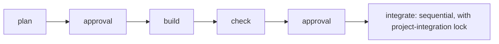

# Built-in Workflows

The authoritative definitions are
[`mohist-local.workflow.yaml`](../../packages/server/src/Mohist.Server/Workflow/Services/Profiles/mohist-local.workflow.yaml)
and
[`mohist-github-pr.workflow.yaml`](../../packages/server/src/Mohist.Server/Workflow/Services/Profiles/mohist-github-pr.workflow.yaml).
A `mohist/*` Profile appears in every Project, but the current Mohist version
owns it. An upgrade changes future Stage initialization; it does not rewrite an
initialized Stage or dispatched Task.

A built-in Profile source cannot be modified or deleted. A Project may configure
a binding explicitly declared by that source without copying it. Create a
Project Profile for structural custom behavior. This document records rationale
and invariants without duplicating YAML.

- `mohist/local`: Rebase with squash locally, then push directly to the base
  branch. This is the default.
- `mohist/github-pr`: Deliver through a draft Pull Request, ready transition,
  and auto-merge.

Select one with:

```bash
mo issue create "..." --workflow-profile mohist/github-pr
```

## Design Drivers

- Local delivery and Pull Request delivery have different shared-boundary risks.
  Keeping two Profiles makes review, authentication, and recovery requirements
  explicit instead of hiding them behind conditional hooks.
- YAML is the single behavioral authority. This document explains why the
  Profiles differ; it does not restate their Task IDs or ordering.
- Every side effect is an explicit Task. Explicit work can be retried, audited,
  and recovered with the same Action contract; an implicit Stage hook cannot.
- A Workspace is rebuildable. The remote Workflow branch is the recovery point
  for Repository work; plan material is Workspace-local, and its loss is an
  accepted loss recovered by rerunning from Plan. Publishing the branch is
  visible in the Definition.
- OpenSpec is not the Workflow's protocol. The only machine-readable plan
  artifact the Workflow consumes is the task list; all other planning material
  is the Agent's free organization. See [`plan-artifacts.md`](plan-artifacts.md).

## Shared Structure

Both Workflows use the same main path:



- Every Stage prepares its Workspace explicitly, so no Task relies on a hidden
  directory or branch transition.
- Agent work runs from the Workspace root so `PLANS/` and `REPOS/` are both in
  scope. Repository-only Actions select `REPOS/<repository-name>` explicitly.
  Runner applies branch and clean-worktree invariants to that Repository in
  both cases; an Action execution directory is not the Git guard boundary.
- Plan produces the named artifacts, including the task list, in one Agent
  session. There is no self-review Task: the approval point is the plan
  review.
- Build expands the approved task list and verifies each increment.
  Check records an independent review as evidence; the verdict belongs to the
  approver. See [`plan-artifacts.md`](plan-artifacts.md) for the review boundary.
- Approval feedback is ordered work in the rejected Stage's Session. This keeps
  feedback and repair context together and makes the next approval inspect the
  repaired result. The engine imposes no round limit: every feedback round is
  initiated by a deciding actor, unlike unattended recovery loops, which keep
  their budgets.
- Recovery belongs beside the Task whose failure it understands. A rebase
  conflict or CI failure is handled explicitly; no hidden recovery hook runs
  at a Stage boundary.

See [`recovery.md`](recovery.md) for recovery and
[`actions.md`](actions.md) for Action contracts.

## `mohist/local`

This is the shortest delivery path and has no GitHub dependency or Pull Request.
Because no remote approval point proves mergeability, Check verifies that the Issue
branch can merge before asking for Approval. Integrate then rebases and
squashes onto the current base and pushes. Keeping the mergeability check
before Approval prevents a stale branch from turning an approved result into a
predictable Integrate failure.

Repository health checks remain explicit Tasks. Their recovery is limited to
the formatting or patch problem they detect and cannot become a general repair
hook.

## `mohist/github-pr`

This Profile opens a draft Pull Request after Plan, marks it ready after Check
Approval, and enables auto-merge during Integrate. Runner host must have an
authenticated `gh` CLI for the target Repository, and the Repository must allow
auto-merge.

Every inline Agent task uses `mohist/agent` with a named built-in Agent; the
Agent definition selects the execution backend and model. Plan, Build, Check,
Integrate, Approval feedback, and recovery all use the same binding. The
versioned Stage graph remains shared and immutable.

The Workflow Workspace has a fixed root layout: the Repository checkout lives
under `REPOS/<repository-name>/` and is the only tree that enters Git; plan
and review material lives under `PLANS/`. See
[`workspaces.md`](../workspaces.md) and [Workspace](../../docs/workspaces.md).
The remote Workflow branch is the recovery point for Repository work. The Pull
Request is a review projection of that branch. Before passing output to another
Stage, Approval, or Pull Request operation, every Repository-modifying Stage
explicitly pushes current HEAD to the Workflow branch. Plan material is not
pushed; it is uploaded as run artifacts. The Profile orders these tasks. Runner
only executes and reports facts. There is no implicit Stage hook.

### Pull Request Boundary

Plan publishes the branch and creates or reuses one draft Pull Request. Its
identity is stored once as Workflow Runtime Variables so later Stages address
the same external review object. Issue title and body remain the source for Pull
Request metadata; copying them into Workflow metadata would create another
authority.

Build publishes verified output because the Workspace is rebuildable and a
later Stage may start from a fresh one. Check publishes the reviewed result, marks the Pull Request
ready, and verifies external checks. Integrate enables auto-merge on the same
Pull Request; the registration Action waits until GitHub performs the merge.

Approval feedback is ordered work: the Agent applies feedback, pushes current
HEAD, and then reruns Stage Checks. The Pull Request and recoverable branch
contain feedback output before the next Approval.

### Recovery and Invariants

Auto-merge moves merge arbitration to GitHub. The synchronous merge's
base-movement and protection-race recovery branches no longer exist. The
merge-time failures the Workflow still owns are classified by the registration
Action's wait: a required check failing after Approval returns
`pr-checks-failed` and takes the same declared fix-and-push recovery the Check
Stage uses; a merge conflict returns `conflict` and follows the rebase
recovery. Enabling auto-merge on a Repository that disallows it is an ordinary
Task failure.

One auto-merge attempt has a fixed 30-minute absolute deadline covering
prechecks, Pull Request reads, subject selection, the registration mutation,
ambiguous-mutation reconciliation, polling, and retry delays. An explicit
subject wins; otherwise the Action uses the title returned by its bounded Pull
Request read. `retry-safe` reports that an explicit later retry is valid. It
does not authorize an unattended Profile recovery, and host cancellation
remains cancellation rather than becoming a retry request.

- Pull Request checks appear at two explicit boundaries. The first runs after
  Check work so a failed external check becomes visible repair work before
  delivery. The second is the Integrate merge wait: external state that changed
  after Approval cannot silently bypass the delivery approval point.
- Exact Task IDs, Action inputs, failure codes, ordering, and recovery behavior
  belong only to the authoritative Profile YAML linked above.
- Every publish and Pull Request side effect is an explicit task. No implicit
  Stage-boundary hook exists.
- `push` has no business recovery. Failure indicates permission, network, or an
  externally modified remote branch and surfaces as ordinary task failure.
- Conflict resolution, check repair, and publishing remain separate work. A
  repair Agent does not silently own a later push.

See [`actions.md`](actions.md) for the Action contract and
[`recovery.md`](recovery.md) for recovery semantics.
