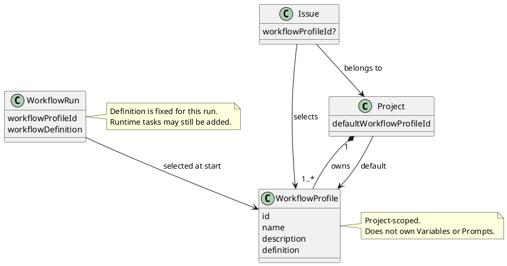

# Workflow Profile

`WorkflowProfile` 是 Project-scoped 资源，定义一个 Issue 如何从 Draft 走到 Done。
一个 Project 可以拥有多个 Profile，并指定其中一个作为默认 Profile。Issue 可以继承默认
Profile，也可以显式选择同一 Project 中的其他 Profile。

Profile 只包含 Workflow 的结构和行为，不包含 Variables 或 Prompts。变量解析见
[`variables.md`](variables.md)，Prompt 解析见
[`../prompt-management.md`](../prompt-management.md)，Action 契约见
[`actions.md`](actions.md)。

## Model



`WorkflowProfile` 的最小模型是：

| Field | Meaning |
|---|---|
| `id` | Profile 在 Project 内的稳定标识 |
| `name` | 面向使用者的名称 |
| `description` | 适用场景的简短说明 |
| `definition` | stages、初始 tasks、checks、approval，以及产生后续 task 的 recovery 等规则 |

`mohist/*` ID 保留给随 Mohist 版本更新的内置 Profile。这些 Profile 在每个 Project 的同一
collection 中可见、可选，也可以作为默认 Profile，但不能修改或删除。其他 ID 的 Profile
由 Project 管理。

Profile 可以通过 `${{ vars.* }}` 和 `${{ prompts.* }}` 引用外部值，但不声明或保存这些
值。固定且只属于某个 task 的 Action Input 应直接写在 `definition` 中。

## Selection

Issue 启动 WorkflowRun 时只做一次选择：

```text
selectedProfileId =
  issue.workflowProfileId ?? project.defaultWorkflowProfileId
```

- Project 默认值必须引用该 Project 拥有的 Profile。
- Issue 显式选择也必须引用同一 Project 中的 Profile。
- 清除 Issue 的显式选择后，Issue 重新继承 Project 默认值。
- Profile 之间不继承、不 merge；选择结果始终是一个完整 Profile。
- WorkflowRun 保存启动时选中的 Profile ID 和 Workflow Definition snapshot。之后修改
  Issue 的选择或 Project 默认值，只影响未来的 WorkflowRun。

Workflow Definition snapshot 对单个 WorkflowRun 固定，但它不是完整的执行计划，也不固定
`StageRun` 中最终产生的 `TaskRun` 序列。运行时 task 的产生与插入见
[`definition.md`](definition.md)。Variables 在每次 task dispatch 前重新解析，Prompt 在
执行时按 key 读取。

## Ownership

`WorkflowProfile` 属于 Workflow 核心域，但以 `ProjectId` 作为 tenancy boundary。Project
持有默认 Profile 引用，Issue 持有可选的显式 Profile 引用；两者都不复制 Profile body。

```text
Issue -> Workflow

WorkflowRun creation -> IWorkflowProfileProvider
                             ^
                     ProjectWorkflowProfileProvider
```

`IWorkflowProfileProvider` 只在 WorkflowRun 创建时按 Project 与 Profile ID 提供经过校验
的 `WorkflowDefinition`。WorkflowRun 保存 Definition snapshot 后不再读取 Provider。
Provider 不读取 Variables 或 Prompts，也不负责 Profile 选择。

## API

Profile collection 是 Project 的子资源：

```text
GET    /api/projects/{projectRef}/workflow-profiles
POST   /api/projects/{projectRef}/workflow-profiles
GET    /api/projects/{projectRef}/workflow-profiles/{*profileId}
PUT    /api/projects/{projectRef}/workflow-profiles/{*profileId}
DELETE /api/projects/{projectRef}/workflow-profiles/{*profileId}
```

Project 的 `defaultWorkflowProfileId` 与 Issue 的 `workflowProfileId` 是对该 collection 的
引用，分别通过 Project 和 Issue resource 修改。删除或替换 Profile 时必须保护仍被默认值
或 Issue 引用的关系；已启动的 WorkflowRun 使用自己的 definition snapshot。

`profileId` 是 terminal catch-all，因此可以无损寻址 `mohist/local` 这类 ID。Variables 与
Prompts 使用独立 API，不挂在 `/workflow-profiles/{*profileId}` 下。

`GET` 和 collection list 同时返回内置与 Project 管理的 Profile。`POST` 不接受
`mohist/*` ID；对内置 Profile 调用 `PUT` 或 `DELETE` 必须返回领域错误。

## Status

与当前实现的差距：

- 当前实现把 system profile、project template 和 Project 的单例 workflow config 分成
  三套概念；目标模型统一为 Project-scoped `WorkflowProfile` collection。
- 当前 `ProjectWorkflowProfile`、`IssueWorkflowProfile` 和 `WorkflowRunProfile` 记录还
  混合保存 Variables 或 Prompt overrides；目标模型将这些资源完全分开。
- 当前 Issue 还可以保存 inline template；目标模型只允许选择 Project 中已有的 Profile。
- 当前有活动 WorkflowRun 时，Issue 的 Profile 选择会被锁定；目标模型允许记录新选择，
  但只对下一次新建的 WorkflowRun 生效。
- 当前 WorkflowRun 主要保存 Profile 身份并实时读取 definition；目标模型要求启动时固定
  definition，使 Profile 编辑不改变进行中的 WorkflowRun。
