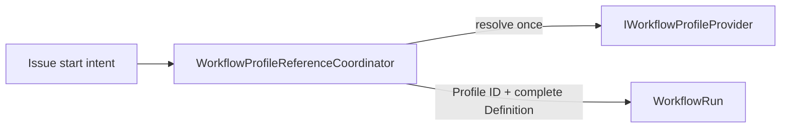

# Workflow Profile

`WorkflowProfile` is a Project-scoped resource that defines how an Issue moves from Draft to Done.
A Project can own multiple Profiles and select one as its default Profile. An Issue can inherit the
default Profile or explicitly select another Profile in the same Project.

A Profile contains only Workflow structure and behavior. It does not contain Variables or Prompts.
See [`variables.md`](variables.md) for Variable resolution,
[`../prompt-management.md`](../prompt-management.md) for Prompt resolution, and
[`actions.md`](actions.md) for the Action contract.

## Model

```text diagram
Project { defaultWorkflowProfileId }
  -- owns 1..* --> WorkflowProfile { id, name, description, definition }
  -- default ---> WorkflowProfile

Issue { workflowProfileId? }
  -- belongs to --> Project
  -- selects ----> WorkflowProfile

WorkflowRun { workflowProfileId, definition }
  -- selected and bound at start --> WorkflowProfile

WorkflowProfile: Project-scoped; does not own Variables or Prompts.
WorkflowRun: Profile ID and complete Definition bind at start.
```

WorkflowProfile is Project-scoped and does not own Variables or Prompts. The minimal model is:

- `id`: stable Profile identifier within a Project.
- `name`: user-facing name.
- `description`: short description of the applicable scenario.
- `definition`: rules for Stages, Tasks, Checks, Approval Feedback, recovery, and related behavior.

WorkflowRun stores the selected Profile ID and the complete validated Definition that was effective at
its binding point. That Definition is immutable for the Run.

IDs under `mohist/*` are reserved for built-in Profiles that update with the Mohist version. These
Profiles are visible and selectable in every Project. They can be the default Profile, but their source
cannot be modified or deleted. The Project manages Profiles with other IDs.

A Profile can reference external values through `${{ vars.* }}` and `${{ prompts.* }}`, but it does not
declare or store those values. An Action Input that is fixed and belongs only to one task must be written
directly in `definition`.

## Agent Task Binding

An executable Agent task uses the `mohist/agent` Action with a named Agent; see
[`../../docs/actions/agent.md`](../../docs/actions/agent.md) and
[`../decisions/workflow-agent-binding.md`](../decisions/workflow-agent-binding.md).
The Agent definition owns Runtime, Model, Reasoning Effort, and Variant. The
Profile supplies `name`, `prompt`, and optional `session` and `timeout` inputs.
Mohist does not insert omitted inputs. Named Session reuse requires the same
Agent and Workspace. AgentJob owns execution, AgentSession owns conversation
continuity, and WorkflowRun owns Approval Point state. Feedback Tasks, recovery
Tasks, and the `mohist/task-list` Task default use the same literal
`mohist/agent` binding. `${{ profile.agentAction }}` and Project Agent Action
overrides do not exist.

## Selection and Binding

An Issue start request captures its explicit Profile selection before durable delivery creates the
WorkflowRun. The Profile coordinator resolves the effective selection at the Run-binding linearization
point:

```text literal
selectedProfileId =
  startRequest.workflowProfileId ?? project.defaultWorkflowProfileId
```

- The Project default must reference a Profile that the Project owns.
- An explicit Issue selection must also reference a Profile in the same Project.
- After the explicit Issue selection is cleared, the Issue inherits the Project default again.
- Profiles do not inherit from or merge with each other. The selection is always one complete Profile.
- The binding captures the selected Profile ID and its complete validated Definition in one payload.
- A later change to the Issue selection, Project default, or Profile Definition affects only future
  WorkflowRuns. It cannot change an active Run.
- The bound Definition is authoritative for every Stage, Approval Feedback behavior, and recovery selection
  in the Run. `mo run view --yaml` reads this Definition.
- `Completed` and `Stopped` WorkflowRuns are immutable terminal records. Retry, rerun, rerun-from-stage,
  and resume reject them. Starting work again creates a new WorkflowRun ID and performs a new binding.

[`task-dispatch.md`](task-dispatch.md) is authoritative for Variable and Prompt evaluation time. Variables
and Prompt bodies are not copied into the bound Definition. At dispatch, Server resolves Effective Stage
Variables and loads Prompt bodies into the immutable attempt snapshot. A later Variable or Prompt edit
can affect only a Task not yet dispatched; it cannot change an already dispatched attempt.

## Ownership

`WorkflowProfile` belongs to the Workflow core domain, with `ProjectId` as its tenancy boundary. Project
holds the default Profile reference. Issue holds an optional explicit Profile reference. WorkflowRun owns
its bound copy of the complete Definition.



The Profile provider participates only in Profile management and Run binding. Active WorkflowRuns do not
read it for Stage, Approval Feedback, recovery, or source-view behavior.

Start binding follows these invariants:

- A Run start has stable Project, Issue, Epic, explicit Profile, metadata, Workspace, and Run identity.
- The coordinator captures the selected Profile ID and complete Definition before participant delivery.
- The participant creates the Run with the complete binding in one transaction. It never patches a
  partially created Run.
- Redelivery uses the captured payload. It cannot resolve a newer Project default or Profile Definition.
- A replay with matching startup facts returns the stored binding. Conflicting facts are rejected.
- The coordinator order is the linearization point. A concurrent Profile edit is entirely before or after
  the Run binding.

## API

The Profile collection is a child resource of Project at
`/api/projects/{projectRef}/workflow-profiles`.

The Project's `defaultWorkflowProfileId` and the Issue's `workflowProfileId` reference this collection.
They are modified through the Project and Issue resources, respectively. Profile deletion must protect a
Profile that is still referenced by a default, an Issue, or an active WorkflowRun. Updating the Definition
while keeping the same ID is allowed. Server validates the new Definition and its Action contracts before
it writes the Profile. The update does not inspect or change active WorkflowRuns.

`profileId` is a terminal catch-all, so it can address an ID such as `mohist/local` without loss. Variables
and Prompts use separate APIs. They are not children of `/workflow-profiles/{*profileId}`.

`GET` and the collection list return both builtin and Project-managed Profiles. `POST` does not accept a
`mohist/*` ID. `PUT` or `DELETE` on a builtin Profile must return a domain error. There is no Profile
Agent Action override mutation.

The collection read models expose Profile identity and structure. Project settings read the effective
default through `/workflow-profile/default`. The Project default mutation uses
`PUT /workflow-profile/default` with `{ "profileId": "..." }`.

`GET /api/workflow-runs/{workflowRunId}` exposes `workflowProfileId` beside the Run status. The Run YAML
read returns the complete bound Definition. Task views expose `agentJobId` and `agentSessionId` for
Agent-backed Tasks.

## Status

Current gaps for complete Definition binding and Approval Feedback are recorded once in
[Core Concepts: Approval Point](../../docs/concepts.md#implementation-gaps).
