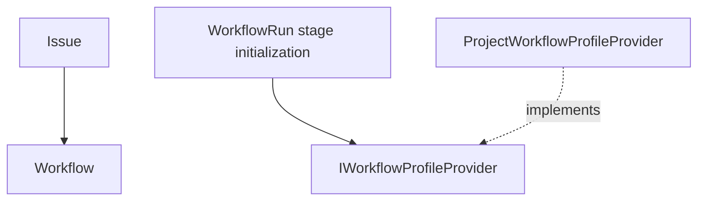

# Workflow Profile

`WorkflowProfile` is a Project-scoped resource that defines how an Issue moves from Draft to Done.
A Project can own multiple Profiles and select one as its default Profile. An Issue can inherit the
default Profile or explicitly select another Profile in the same Project.

A Profile contains only Workflow structure and behavior. It does not contain Variables or Prompts.
See [`variables.md`](variables.md) for Variable resolution,
[`../prompt-management.md`](../prompt-management.md) for Prompt resolution, and
[`actions.md`](actions.md) for the Action contract.

## Model

```text diagram
Project { defaultWorkflowProfileId }
  -- owns 1..* --> WorkflowProfile { id, name, description, definition }
  -- default ---> WorkflowProfile

Issue { workflowProfileId? }
  -- belongs to --> Project
  -- selects ----> WorkflowProfile

WorkflowRun { workflowProfileId }
  -- selected at start --> WorkflowProfile

WorkflowProfile: Project-scoped; does not own Variables or Prompts.
WorkflowRun: Profile identity is fixed; Definition resolves as each Stage starts.
```

WorkflowProfile is Project-scoped and does not own Variables or Prompts.
WorkflowRun fixes the Profile identity and Agent Action; the Definition
resolves as each Stage starts.

The minimal `WorkflowProfile` model is:

- `id`: stable Profile identifier within a Project.
- `name`: user-facing name.
- `description`: short description of the applicable scenario.
- `definition`: rules for Stages, initial tasks, checks, Approval, recovery that creates later
  tasks, and related behavior.

IDs under `mohist/*` are reserved for builtin Profiles that update with the Mohist version. These Profiles
are visible and selectable in the same collection for every Project. They can be the default Profile, but
their source cannot be modified or deleted. The Project
manages Profiles with other IDs.

A Profile can reference external values through `${{ vars.* }}` and `${{ prompts.* }}`, but it does not
declare or store those values. An Action Input that is fixed and belongs only to one task must be written
directly in `definition`.

## Agent Task Binding

An executable Agent task uses the `mohist/agent` Action with a named Agent; see
[`../../docs/actions/agent.md`](../../docs/actions/agent.md) and
[`../decisions/workflow-agent-binding.md`](../decisions/workflow-agent-binding.md).
The Agent definition owns Runtime, Model, Reasoning Effort, and Variant; the
Profile supplies only `name`, `prompt`, the optional `session`, and the optional
`timeout`. `${{ profile.agentAction }}` and Project Agent Action overrides do
not exist. Approval feedback, recovery tasks, and the `mohist/task-list` task
default use the same literal `mohist/agent` binding.

## Selection

An Issue start request snapshots its explicit Profile selection before durable delivery creates the
WorkflowRun. The Profile coordinator resolves the effective selection at the Run-binding linearization
point:

```text literal
selectedProfileId =
  startRequest.workflowProfileId ?? project.defaultWorkflowProfileId
```

- The Project default must reference a Profile that the Project owns.
- An explicit Issue selection must also reference a Profile in the same Project.
- After the explicit Issue selection is cleared, the Issue inherits the Project default again.
- Profiles do not inherit from or merge with each other. The selection is always one complete Profile.
- WorkflowRun stores the Profile ID selected at start. A later change to the Issue selection or Project
  default affects only future WorkflowRuns. It does not switch an active Run to another Profile.
- `Completed` and `Stopped` WorkflowRuns are immutable terminal records. Retry, rerun, rerun-from-stage,
  and resume reject them. Starting work again creates a new WorkflowRun ID and resolves the then-current
  Profile through the normal start-binding path.
- After the Definition for the same Profile ID changes, an active Run reads the new version when it
  initializes a later Stage.
- A custom Profile update must retain every Stage ID in each active Run's stored startup skeleton. The Run
  keeps its stored Stage order and `requiresApproval` values; new or reordered Stages affect only future
  Runs.

WorkflowRun does not store a complete Workflow Definition snapshot. Run creation materializes only the
StageRun and Approval facts needed to advance the lifecycle. When each Stage initializes, it uses
`workflowProfileId` to read the Stage structure from the current Profile Definition again. A Profile edit
does not rewrite a Stage that is already initialized. See [`definition.md`](definition.md) for runtime task creation and insertion.

[`task-dispatch.md`](task-dispatch.md) is authoritative for Variable and Prompt evaluation time. At
dispatch, the Server resolves Effective Stage Variables for the current Stage and loads each Prompt body by
key. It sends them to the Runner with the original `with` and `expect` declarations as an immutable attempt
snapshot. At the execution entry point, the Runner renders the original `with` and `expect` from that
snapshot before it calls the Action. A dispatched attempt does not read the latest Variables or Prompt
again. Its snapshot remains unchanged for the lifetime of that attempt.

## Ownership

`WorkflowProfile` belongs to the Workflow core domain, with `ProjectId` as its tenancy boundary. Project
holds the default Profile reference. Issue holds an optional explicit Profile reference. Neither copies the
Profile body.

Physical persistence follows the existing ownership boundary. The Project WorkflowProfile settings row
stores the Project default reference; it does not create mutable rows for builtin Profile source.
WorkflowRun state stores the explicit Profile selection and resolved Profile ID.



At WorkflowRun creation, the Profile coordinator uses `IWorkflowProfileProvider` to resolve the Profile
source. At each Stage initialization the Provider supplies the current, validated `WorkflowDefinition`
by Project and Profile ID. WorkflowRun does not store the Definition body. The Provider does not read Variables or Prompts and does not select the
Profile outside the start-binding command.

The Project-scoped `WorkflowProfileReferenceCoordinator` serializes custom Profile updates and
WorkflowRun binding. An update validates the stored startup skeletons read from active Run state before
it writes the Profile. Start binding follows these invariants:

- A Run start has stable Project, Issue, Epic, explicit Profile, metadata, and workspace facts under
  one `workflowRunId`. The Issue transaction first commits an `IssueWorkStarted` start intent with
  that fixed Run ID, Profile selection, and repository/workspace snapshot. Only after this durable
  intent commits may the WorkflowRun participant create executable state. Both the synchronous start
  path and durable event delivery drive the same idempotent `EnsureStarted` operation, so a process
  exit can leave pending intent but cannot leave an executable Run that no Issue owns.
- The coordinator settles any pending fence first, then asks the participant for an existing Run
  with that ID. A request whose stable startup facts match returns the persisted binding without
  reading the current Project default, Profile source, or Action override; any conflicting startup
  fact is rejected.
- When no Run exists, the coordinator persists the resolved start payload (start identity, Profile
  ID, and ordered Stage skeleton) in its pending fence before delivery. The
  participant then creates the Run with that complete binding and Stage skeleton in one transaction.
  It never patches a partially created Run.
- Redelivery uses the payload captured in the fence. A crash before participant commit is replayed;
  a crash after commit is observed as already applied. If the coordinator cleared its fence and the
  response was then lost, the retry returns the binding stored in the Run instead of resolving newer
  configuration.
- The coordinator order is the linearization point: a concurrent Run starts entirely before or after
  a Profile or override change, never between its resolution, validation, and initial persistence.

## API

The Profile collection is a child resource of Project at
`/api/projects/{projectRef}/workflow-profiles`.

The Project's `defaultWorkflowProfileId` and the Issue's `workflowProfileId` reference this collection.
They are modified through the Project and Issue resources, respectively. Profile deletion must protect a
Profile that is still referenced by a default, an Issue, or an active WorkflowRun. Updating the Definition
while keeping the same ID is allowed. Before committing an update, Server validates the future effective
Action, every distinct Action bound to an active Run, and every active Run's stored Stage/Approval skeleton.
An active WorkflowRun reads the accepted version at a later Stage initialization.

`profileId` is a terminal catch-all, so it can address an ID such as `mohist/local` without loss. Variables
and Prompts use separate APIs. They are not children of `/workflow-profiles/{*profileId}`.

`GET` and the collection list return both builtin and Project-managed Profiles. `POST` does not accept a
`mohist/*` ID. `PUT` or `DELETE` on a builtin Profile must return a domain error. There is no Profile
Agent Action override mutation.

The collection read models expose Profile identity and structure. Project settings read the effective
default through `/workflow-profile/default`. The Project default mutation uses
`PUT /workflow-profile/default` with `{ "profileId": "..." }`.

`GET /api/workflow-runs/{workflowRunId}` exposes `workflowProfileId` beside the Run status; task views
expose `agentJobId` and `agentSessionId` for Agent-backed tasks.

## Status

Implemented: the Project-scoped WorkflowProfile collection, including builtin `mohist/*` and
Project-managed Profiles; the Project default and explicit Issue selection, including clearing with
`--inherit-workflow-profile`; reference protection on deletion; the ability to change an Issue selection
during an active Run with an effect only on the next Run; a fixed Profile ID for a Run with live Definition
reads at Stage initialization and no Definition snapshot; and separate Variables and Prompts resources.

Implemented: the unified Agent task binding. Profiles declare literal `mohist/agent` tasks; the
`agentAction` Profile metadata, the `${{ profile.agentAction }}` expression, Project Agent Action
overrides, the `PATCH` override mutation, and the nullable `agentRuntime` projection are removed.
