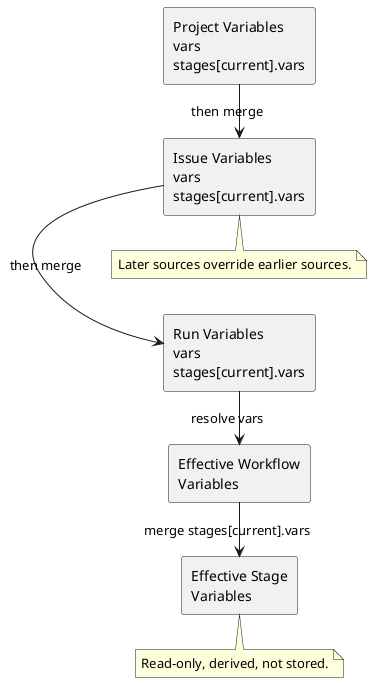

# Workflow Variables

Workflow Variables 是独立于 WorkflowProfile 的资源。Project、Issue 和 WorkflowRun 都
可以保存 Variables；系统按确定顺序合并它们，并为当前 Stage 产生 Effective Variables。

本文只定义变量的资源形状、合并与生效语义。Profile 的选择和结构见
[`profile.md`](profile.md)，模板命名空间见 [`task-dispatch.md`](task-dispatch.md)，Action
output 到 Run Variables 的投影见 [`actions.md`](actions.md#setvars)。

## Model

Project、Issue 和 WorkflowRun 的 Variables 使用相同形状：

```json
{
  "vars": { "agent": { "model": "gpt-5" } },
  "stages": {
    "check": { "vars": { "agent": { "variant": "high" } } }
  }
}
```

- `vars` 是对所有 Stage 生效的 Workflow Variables。
- `stages.<stage>.vars` 只对指定 Stage 生效。
- Project Variables 为 Project 中的 Workflow 提供公共值。
- Issue Variables 对单个 Issue 覆盖或补充 Project Variables。
- Run Variables 保存单次 WorkflowRun 的动态值；task `setVars` 写入这里。

WorkflowProfile 可以引用变量，但不拥有、声明或限制变量 key。变量只有被 Profile、task、
check、recovery 或 Prompt 引用时才会影响执行。



- **Effective Workflow Variables**：按 Project → Issue → Run 合并 `vars` 后得到的、与
  Stage 无关的结果。
- **Effective Stage Variables**：从 Effective Workflow Variables 开始，再按 Project →
  Issue → Run 合并当前 Stage 的 `stages.<stage>.vars` 后得到的结果。

两种 Effective Variables 都是只读派生值，不单独持久化。

## Semantics

解析先合并 Workflow Variables，再合并当前 Stage Variables：

```text
resolve(currentStage, project, issue, run):
  result = {}

  for variables in [project, issue, run]:
    result = merge(result, variables.vars)

  effectiveWorkflowVariables = result

  if currentStage is null:
    return effectiveWorkflowVariables

  for variables in [project, issue, run]:
    result = merge(result, variables.stages[currentStage].vars)

  effectiveStageVariables = result
  return effectiveStageVariables
```

完整优先级从低到高是：

```text
project.vars
-> issue.vars
-> run.vars
-> Effective Workflow Variables
-> project.stages[current].vars
-> issue.stages[current].vars
-> run.stages[current].vars
-> Effective Stage Variables
```

当前 Stage 的 Variables 比任意 scope 的 Workflow Variables 更具体，因此总是在
Effective Workflow Variables 之后应用；同为 Stage Variables 时，Run 覆盖 Issue，Issue
覆盖 Project。

### Merge

| Later value | Result |
|---|---|
| 字段不存在 | 继承已有值 |
| object | 按字段递归合并 |
| scalar | 替换已有值 |
| array | 整体替换，不按元素合并 |

`vars` 和每个 `stages.<stage>.vars` 的根必须是 object。merge 不修改任何来源资源；
持久化的 Variables document 不接受 `null` 值。

### Writes

三个 Variables resource 使用相同方法和 body 语义，地址只决定修改哪个 scope：

| Scope | Variables resource |
|---|---|
| Project | `/api/projects/{projectRef}/variables` |
| Issue | `/api/projects/{projectRef}/issues/{number}/variables` |
| Run | `/api/workflow-runs/{workflowRunId}/variables` |

- `GET` 读取该 scope 保存的 Variables，不做跨 scope 解析。
- `PUT` 用完整 Variables document 替换该 scope 的值。
- `PATCH` 把部分 Variables document deep merge 到该 scope；`null` 只作为删除指令，清除
  目标 scope 的字段，使其重新继承前一个 scope。`null` 不会被持久化。

Effective Variables 是 Run 下的独立只读资源：

```text
GET /api/workflow-runs/{workflowRunId}/variables/effective
GET /api/workflow-runs/{workflowRunId}/variables/effective?stage={stage}
GET /api/workflow-runs/{workflowRunId}/variables/effective/{keyPath}
```

不传 `stage` 时返回 Effective Workflow Variables；传入 `stage` 时返回 Effective Stage
Variables。

Project 和 Issue 的设置入口可以同时修改 `vars` 与 `stages`。task `setVars` 不是另一套
API：Runner 把 Action output 投影成只包含 `vars` 的 PATCH body，再调用 Run Variables
resource：

```json
{ "vars": { "change": { "prNumber": 42 } } }
```

task `setVars` 不生成 `stages` 参数，因此只修改 Run 的 Workflow Variables；Run
Variables resource 本身仍支持其他调用方显式修改 `stages`。

### Changes

- 建立每个 attempt 的 context snapshot 时，重新解析当前 Stage 的 Effective Stage
  Variables。Variables resolution 只产生 context，不展开 task declaration；展开边界见
  [`task-dispatch.md`](task-dispatch.md)。
- attempt 被接受后，其 context snapshot 和 rendered input 固定，不受后续变量调整影响。
- 尚未派发的 task 使用最新变量；人工 retry 与 recovery continuation 都是新 attempt，也使用
  各自开始时的最新变量。
- task `setVars` 在 Action 成功返回后、task 报告完成前执行。任一 output 投影失败时，
  Run Variables 不变，task 失败。

Effective Variables 只通过 `${{ vars.* }}` 显式进入 task `with`、task-level `expect` 或
其他支持模板的声明。Action 只能看到展开后的 input，不能再次读取 Variables resource。

`workflow.*`、`stage.*`、`issue.*`、`repository.*` 等 runtime context，
`tasks.<id>.outputs.*` 和 `prompts.*` 都是独立命名空间，不参与 Variables merge。

非法 Variables、无法完成的 `setVars` 和其他语义错误必须在写入边界被拒绝，返回领域级
错误并保持原值不变，而不是静默忽略或只暴露 parser stack trace。

## Examples

### Scope and stage override

```yaml
stage: check

projectVariables:
  vars:
    agent: { model: sonnet, variant: medium }
  stages:
    check:
      vars:
        agent: { variant: high }

issueVariables:
  vars:
    agent: { model: gpt-5 }
    review: { strict: true }
  stages:
    check:
      vars:
        agent: { variant: xhigh }

runVariables:
  vars:
    change: { prNumber: 42 }

effectiveWorkflowVariables:
  agent: { model: gpt-5, variant: medium }
  review: { strict: true }
  change: { prNumber: 42 }

effectiveStageVariables:
  agent: { model: gpt-5, variant: xhigh }
  review: { strict: true }
  change: { prNumber: 42 }
```

合并过程：

| Applied source | `agent.model` | `agent.variant` |
|---|---|---|
| Project Workflow Variables | `sonnet` | `medium` |
| Issue Workflow Variables | `gpt-5` | `medium` |
| Effective Workflow Variables | `gpt-5` | `medium` |
| Project `check` Stage Variables | `gpt-5` | `high` |
| Issue `check` Stage Variables | `gpt-5` | `xhigh` |
| Effective Stage Variables | `gpt-5` | `xhigh` |

Run 没有覆盖 `agent`。Project 的 `check` Stage Variables 先覆盖 Effective Workflow
Variables 的 `medium`，随后 Issue 的同名值再将其覆盖为 `xhigh`。

### Live adjustment

| 时刻 | 行为 | task 使用的 model |
|---|---|---|
| 1 | Project Variables 中的 model 是 `model-a`，派发 task-1 | `model-a` |
| 2 | Project Variables 中的 model 改为 `model-b` | task-1 不变 |
| 3 | 派发 task-2 | `model-b` |
| 4 | retry task-1 | `model-b` |

## Status

仍需确定 TaskRun 保存 resolved input 是否已经足够审计，还是 Variables resource 还需要
revision。

与当前实现的差距：

- 当前 Project、Issue 和 Run Variables 仍存放在带 `WorkflowProfile` 名称的记录和 API
  下；目标资源路径不再包含 `workflow-profile`。
- 当前 Profile YAML 仍可包含 embedded variables，配置中还有 global variables；目标模型
  只从 Project、Issue 和 Run Variables 解析。
- 当前 merge 可以用持久化 `null` 屏蔽前一个 scope 的值；目标模型暂不提供这一额外状态，
  `null` 只用于清除当前 scope 的声明并恢复继承。
- 当前没有在所有写入边界统一拒绝非 object 根；目标 validator 必须在写入前拒绝。
- 当前普通 dispatch 已实时解析 Variables，但 Server 会先把 task declaration 展开，
  recovery self retry 因而可能把旧值固化进后续 attempt。issue #465 分离 declaration、
  attempt context 与 rendered input；该 issue 不给 Variables resource 增加 revision，审计是否
  需要额外 revision 仍是上面的开放问题。

本 WIP spec 固定目标语义，不把当前 `VariableBundle`、API DTO 或数据库 JSON 当作领域
对象。实现可以使用 resolver 或 provider 隐藏读取与合并；这些是内部实现细节，不进入
领域模型。
