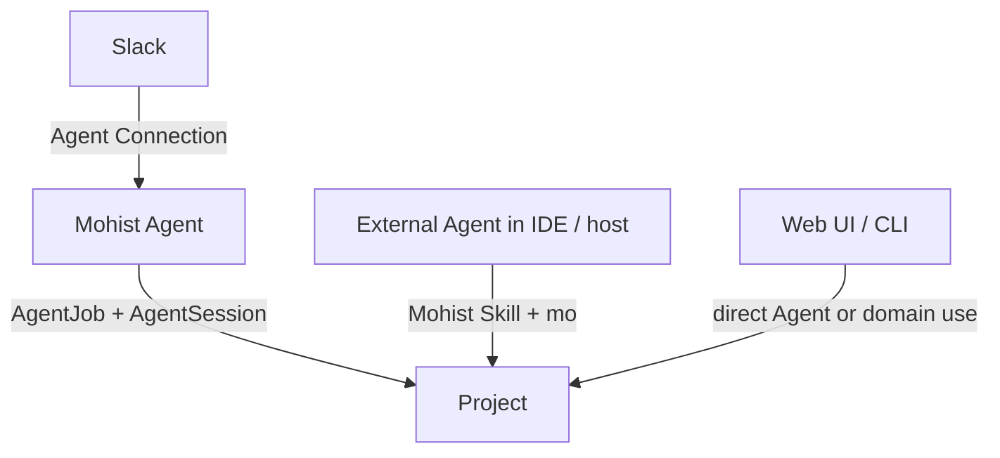
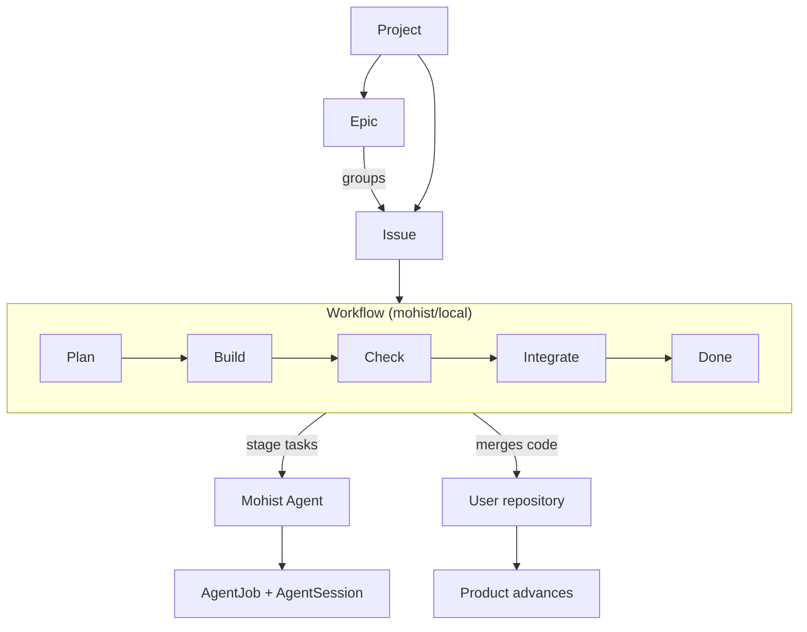

# Core Concepts

These concepts explain how Mohist continuously advances work to Done.

## In One Paragraph

> You usually stay in your existing workspace. An **Agent Connection** can
> expose a configured **Mohist Agent** there, or a third-party **External Agent**
> can operate Mohist through a **Skill**. Within a **Project**, Mohist records a
> product goal as an **Issue** and uses a **Workflow** to advance it to Done.
> Multiple related Issues form an **Epic**. A **Workflow** advances an Issue by
> launching configured **Mohist Agents** for its Agent-backed tasks and running
> mechanical Actions for orchestration. The same Agents can also
> accept delegated work or respond to events outside a Workflow.

## Project

A Project corresponds to one real product. It is the product scope and execution
boundary in Mohist. It is not the user's chat or collaboration workspace.

- Each Project declares one or more git **repositories** as execution resources.
  Each repository has a resource name and base branch, and one is the default.
- Each Issue in a Project has a **target repository**. Without an explicit
  target, it uses the default repository.
- Only one Project can be active at a time. Use `mo project use` to switch the
  active CLI Project.
- Data is fully isolated between Projects.

```bash
mo project create my-app --path /path/to/repo   # Register this as the default repository.
mo project use my-app
mo runner status   # Show Runners and shared execution capacity.
```

**Multiple-Project example**: Create one Project for side project A and another
for side project B. Switch between them as necessary.

**Multiple-repository example**: If the product server and Web UI are separate
repositories, declare both in one Project. Each Issue routes to its target
repository. See [Repositories](repositories.md).

Execution within a Project occurs in a **Workspace**. An Issue gets a clean
Workspace when it starts. An interaction entry point, such as a Slack channel,
has a persistent Workspace. See [Workspace](workspaces.md).

## Issue

An Issue is one unit of work that can enter the production line.

- A title and body that describe the requirement
- A priority
- Free-text labels
- A target repository in which the work executes; see
  [Repositories](repositories.md)
- State such as stage, health, and `approvalState` after it enters a Workflow
- Plan and review artifacts after completion, recorded as run
  artifacts

If one requirement crosses multiple repositories, split one Issue into
**child Issues**. The parent Issue tracks the complete requirement, and each
child Issue moves through its own Workflow. See
[Composite Issues and Child Issues](composite-issues.md).

See [Issue Management](issues.md).

## Workflow

A Workflow is the production line that moves a ready Issue from an idea to
merged code. Draft and Backlog remain outside the Workflow so requirement
readiness and execution state cannot be confused. The default Mohist Workflow
has five stages: Plan, Build, Check, Integrate, and Done.

Before the Workflow starts, Draft protects an incomplete requirement and
Backlog identifies work that may start. Each Workflow stage then has one
purpose:

- **Plan**: A configured Mohist Agent understands the requirement and produces
  `PLANS/PLAN.md`, `PLANS/DESIGN.md`, and the executable task list.
- **Build**: A configured Mohist Agent writes code and runs tests according to the tasks.
- **Check**: A configured Mohist Agent reviews its output.
- **Integrate**: Mohist merges the branch into the base branch.

Some stages, Plan and Check by default, enter an **Approval Point** after
completion. They wait for an Approve or Request Changes decision. The approver
does not have to be a specific type of actor. See [Approval Point](#approval-point).

See [The Workflow](the-workflow.md) for the complete state machine.

### Workflow Profile

A Workflow is not hard-coded. Each Project can have multiple **Workflow
Profiles** and select one default Profile. An Issue can inherit the default or
select another Profile in the same Project.

A Profile defines stages, task ordering, the Mohist Agent used by each executable
task, checks, Feedback Tasks, recovery, and Approval Points. It does not copy Agent configuration,
Variables, or Prompt bodies. Project, Issue, and Run Variables merge by scope.
Prompts are configured only in the Project.

An Issue may also select no Workflow at all (`mo issue create --no-workflow`).
It then runs no production line: starting moves it directly to in progress,
and completion is recorded by `mo issue done`, `mo issue close`, or — for an
Issue linked to GitHub — by the GitHub Issue's lifecycle; see
[GitHub](github.md).

The built-in Profiles are:

- `mohist/local`: The complete five-stage process with local integration; this
  is the default.
- `mohist/github-pr`: Uses a GitHub pull request in the Integrate stage.

See [Workflow Profile](workflow-profiles.md).

## Epic

An Epic continuously supplies work for one product goal. A new Epic is `idle`
by default. **Start** begins automatic advancement. After one linked Issue
finishes, the Epic starts the next Issue that can advance.

See [Planning with Epics](epics.md) for the complete lifecycle.

## External Agent, Mohist Agent, and Agent Connection

An External Agent interacts with the user outside Mohist. For example, it can
run in Slack, an IDE, or another Agent host. It uses the Mohist Skill and `mo`
to query, delegate to, or operate the execution layer. It is not a Mohist
resource, and Mohist does not schedule it.

A Mohist Agent has a stable ID, name, Instructions, Skills, and execution
configuration in one Project. A Workflow task, the Web UI, CLI, an Agent
Connection, event routing, or a comment mention all start it through the same
AgentJob launch boundary. Workflow tasks do not select Runtime-specific Actions
or create anonymous Agent capability.

An Agent Connection exposes one Mohist Agent in an external interaction
location. For example, a Slack Agent Connection lets a Slack Bot represent a
specified Mohist Agent. Slack receives messages and presents replies. The
Mohist Agent still owns understanding, execution, and the session. The
connection does not copy Agent configuration and cannot switch to another Agent
within one conversation.

A Slack connection presents two types of App to the user. The **Mohist App** is
the management entry point installed once in a Slack workspace. It establishes
the workspace connection and manages Agent Connections; it is neither a
business Agent nor an Agent App. Users talk to it in natural language to
connect, adjust, diagnose, and create Agents. An **Agent App** is an execution
entry point. Each connected Mohist Agent has a separate Slack App and bot
identity that accepts work and returns results directly. Management operations
and work tasks use clear, separate identities. One identity does not send on
behalf of the other.

An AgentSession is not an Agent or a work result. It records the messages,
context, usage, Activity, and current Runtime Session for a conversation. An
AgentJob owns every top-level Agent execution, including a `mohist/agent`
Workflow task. The
WorkflowRun keeps orchestration state, its complete bound Definition, and the
AgentJob reference. Subsequent
input continues the same AgentSession but does not rewrite the AgentJob. Each
accepted input in an AgentSession is a SessionInput. One continuous Runtime
processing period is an AgentTurn. One AgentTurn can process multiple
SessionInputs in order. Messages, execution, and work results therefore do not
share one state.

See [Agents and AgentSessions](agent-sessions.md) for the complete relationship
and [Slack](slack.md) for Slack behavior.

## Approval Point

An Approval Point waits for one of two decisions about the current Stage
output:

- **Approve** completes the Stage and lets the Workflow advance.
- **Request Changes** records Approval Feedback and starts the configured
  Feedback Tasks. It is nonterminal and does not fail the Approval Point.

Request Changes is available only when the active WorkflowRun's complete
bound Workflow Definition contains a non-empty `approval.feedback.tasks` list.
Before recording the decision, WorkflowRun validates the request, the current
Approval Point, and the complete declared Feedback Task list from that bound
Definition. A validation failure changes no Approval Point, Stage, Approval
Feedback, Task, Check, WorkflowRun status, event, revision, or other Run state.
There is no separate Reject decision. Mohist does not create a default Feedback
Task or add an Agent, prompt, Session, timeout, or publication step. Stop is
terminal when the Run must not continue.

Mohist applies Approval Feedback in this order:

1. Run the declared Feedback Tasks in order.
2. Run the current Stage Checks again.
3. Return to the same Approval Point.

The original Stage Tasks do not run again. Mohist does not limit how many
times an approver can select Request Changes.

Each `mohist/agent` Task explicitly names its Agent and can name a Session.
Mohist reuses a named Session only when the Agent and Workspace are the same.
An omitted Session requests no named reuse. AgentJob owns execution, and
AgentSession owns conversation continuity. WorkflowRun owns Approval Point
state.

The complete bound Definition controls the Stages, Approval Feedback, and
recovery behavior for the complete WorkflowRun. Later Profile edits affect
only future WorkflowRuns. Variables and Prompt bodies keep their separate
dispatch-time behavior; see [Workflow Profile](workflow-profiles.md) and
[Workflow Definition Reference](workflow-definition.md).

An approver can be a person, a Mohist Agent, a script, or external automation.
All use the same Approve and Request Changes actions. Authentication identity
determines attribution for decisions and comments. `--display-name` is only a
presentation alias and does not change ownership. See
[Authentication and Access](auth.md).

### Implementation Gaps

Current WorkflowRun source, status, and recovery reads still consult live Profile
data in some paths, and current Profile update guards still inspect active Runs.
`WorkflowRun.Feedback` retains resolved Approval Feedback in an unbounded list.
The CLI, API, and supervision preset still expose legacy `reject` paths,
and runtime emits duplicated terminal and nonterminal `Rejected` event semantics.
The built-in Profile stores the Pull Request number and URL as mutable Run Variables,
and later Action inputs read the number without an immutable
WorkflowRun Pull Request identity guard. Review translation currently parses PR
head branch naming (`mo/issue-*`) instead of resolving that identity; it does not
route through `github.pr.url`.

## Skill

A Skill is a reusable description of an Agent capability. An External Agent
can install a Mohist-distributed Skill to understand Mohist domain actions and
operating boundaries. A Mohist Agent can select Skills in its configuration and
use the same capabilities through every entry point. An entry point cannot add
or remove Skills for the Agent.

Mohist distributes a Skill catalog that covers its domain actions, such as
operating Mohist from an External Agent, exploring a requirement, and creating
Issues and Epics.

An External Agent typically loads these Skills as necessary, sends intent to
Mohist through `mo`, and returns execution state and results to its original
conversation. The Skills of a Mohist Agent are part of the Agent configuration
and are fixed for the unit of work when it starts. See [Skills](skills.md).

## How the Concepts Fit Together



Inside one Project, Epics supply Issues and each Issue moves through its
Workflow, whose stage tasks run as Mohist Agents:



Keep one mental model: **You usually stay in an existing workspace. A Mohist
Agent is an independently usable proxy, and an Agent Connection only brings it
to Slack. An External Agent can also use Mohist through a Skill. A Project is
the product and execution boundary. An Epic owns a goal and supplies work. An
Issue is the workpiece. A Workflow is the production line. Mohist Agents are
the workers for Agent-backed Workflow tasks and direct delegation; mechanical
Actions remain Workflow orchestration. AgentJob owns each Agent execution, and
AgentSession records its continuing conversation. The Web
UI is the fallback operations and visualization plane.**

---

Implementation source: See the domain decomposition in
[`design/domain-analysis.md`](../design/domain-analysis.md).
