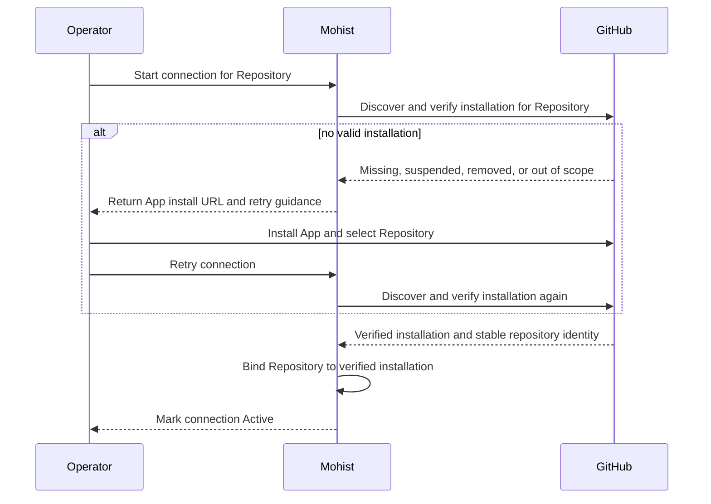
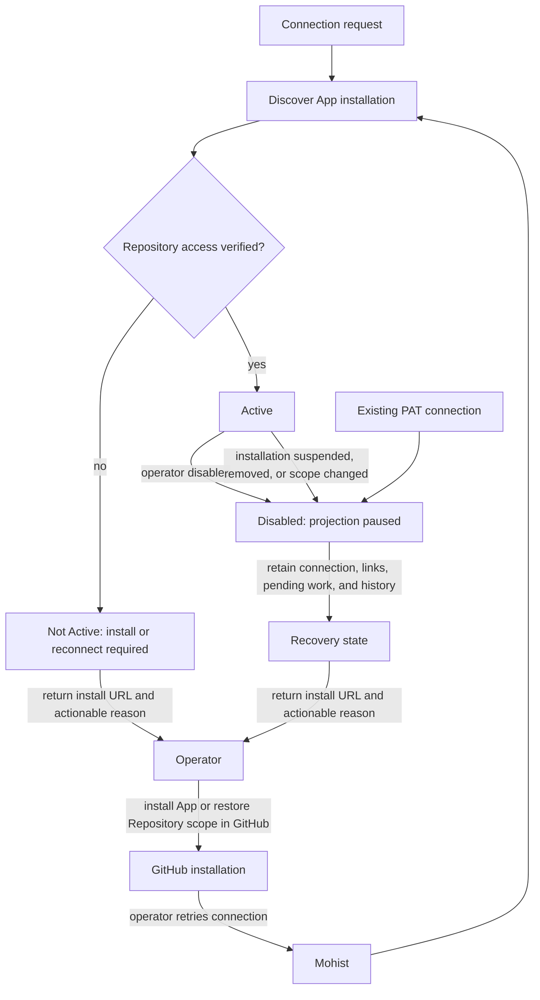

# GitHub

The GitHub integration makes a connected GitHub repository the public mirror of
a Mohist Project's work. Once a Repository is connected, every Mohist Issue
targeting it has exactly one GitHub Issue as its mirror. A GitHub Issue, in
contrast, belongs to GitHub alone until someone explicitly hands it to Mohist.

The two directions follow different rules:

- **Mohist to GitHub is passive.** Creating and updating a Mohist Issue
  projects to its GitHub mirror automatically. Nobody asks for synchronization.
- **GitHub to Mohist is imperative.** A GitHub Issue enters Mohist only through
  an explicit command in a GitHub comment. Nothing is imported by labels or
  filters.

Mohist remains the authority for execution state. For a linked pair, the two
sides keep title and body in sync, while Workflow state projects only from
Mohist to GitHub.

Delivery through a GitHub Pull Request during the Integrate stage is separate.
See [Workflow Profiles](workflow-profiles.md) and
[GitHub PR Actions](actions/github-pr.md).

## Mental Model

- **The GitHub Issue is the superset.** Everything Mohist tracks is visible on
  GitHub; not everything on GitHub is tracked by Mohist.
- **A mirror, not a second issue tracker.** The mirror's number, URL, and sync
  health are first-class facts of the Mohist Issue. An Agent reading
  `mo issue view` never parses labels or constructs URLs to find it.
- **One command brings work in.** `/mohist start` in a GitHub comment hands an
  Issue to the Mohist Workflow.
- **A linked pair shares content, not execution.** Title and body synchronize
  in both directions. Stage, Approval, and Run state project only outward.
- **A Workflow is optional.** An Issue without a Workflow Profile runs no
  production line; when linked, its lifecycle follows the GitHub Issue. See
  [Issue Management](issues.md).

## Connecting Repositories

A GitHub connection binds one GitHub repository to one registered Repository of
the Project; see [Repositories](repositories.md). A Project that declares
several repositories can hold several connections. An Issue never carries
GitHub coordinates: its mirror location is determined by its target repository.

The target connection uses the one GitHub App owned by the Mohist deployment:

- The deployment owns the App credential. The CLI, Web client, Repository
  configuration, and connection response never carry the App private key.
- Mohist discovers the App installation for the selected Repository and verifies
  that the installation can access it. The connection records the verified
  installation and the repository's stable GitHub identity, not only its
  changeable owner and name.
- If no valid installation exists, Mohist returns the App installation URL. The
  operator installs the App, selects the Repository in GitHub, and retries.
- A connection becomes `Active` only after that verification. Outbound Server
  calls use short-lived installation tokens; the operator never enters or sees
  those tokens.
- The existing per-connection signed Repository webhook remains the inbound
  event boundary. The GitHub App does not introduce a global webhook path.
- Runner `gh` authentication remains a separate credential boundary for git and
  Pull Request operations. Server installation tokens are not Runner
  credentials.



An optional approver list enables
[Pull Request Review as Approval](#pull-request-review-as-approval).

## Connection Lifecycle

An `Active` connection can mirror Issues and receive events through its signed
Repository webhook. An operator may disable it, or Mohist may disable it when
the installation is suspended, removed, or no longer includes the bound
Repository. `Disabled` pauses projection and marks reconnect-required when the
installation must be repaired. Connection deletion is unsupported. Disable and
reconnect preserve the connection, links, pending durable work, and history.

When the App contract is introduced, every existing PAT-backed connection
becomes `Disabled` with reconnect-required status. The operator must reconnect
through the App. Mohist does not convert a PAT, fall back to a PAT, or discard
existing links and pending work.

A short-lived installation token is replaced when it expires. Token refresh does
not change an otherwise valid connection's state. If installation verification
fails, the connection follows the disabled recovery path.



The existing connection listing remains the operator's view of every Repository
and its connection state:

```bash
mo github list
```


## The Mirror: Mohist to GitHub

When a new Issue's target repository is connected, Mohist creates the GitHub
mirror as part of creation and records a permanent one-to-one link. A Draft is
not mirrored; the mirror appears when the Issue is marked ready. The creating
side owns the initial content: a mirror created from Mohist takes the Mohist
title and body.

After creation, the mirror carries:

- **Title and body**, kept in sync in both directions; Mohist retains one invisible HTML marker in the raw GitHub body for unknown-create reconciliation, while the rendered body has no tracking footer; see
  [Linked Pairs](#linked-pairs).
- **Lifecycle projection.** Completing or cancelling the Mohist Issue closes
  the mirror with the matching reason.
- **Workflow progress** as the mutually exclusive `mohist:*` state labels
  (`in-progress`, `awaiting-approval`, `blocked`, `done`) and four low-volume
  milestone comments: mirror confirmation with the Mohist Issue link, arrival
  at an Approval point, completion with a delivery summary and Pull Request
  link, and cancellation with a reason.

Never mirrored: Mohist comments, labels, priority, model and runtime
configuration, prerequisites, Epic membership, and Workspace or Session facts.

A mirror failure never blocks the production system. See
[Sync Health and Recovery](#sync-health-and-recovery).

## Handing a GitHub Issue to Mohist

A comment starting with `/mohist` on an Issue in a connected repository is a
command. The first verb is:

```text literal
/mohist start
```

It creates the Mohist Issue from the GitHub title and body, records the link,
and starts the Workflow with the Project's default Profile — one utterance for
what `mo issue create` plus `mo issue start` do. GitHub labels `p0` through
`p4` map to Mohist priority at this moment.

Rules:

- **Permission comes from GitHub.** Only a commenter GitHub reports as a
  repository owner, member, or collaborator can hand work in. Other commands
  are ignored.
- **Idempotent.** A repeated `/mohist start` on an already-linked Issue replies
  with the existing Mohist Issue link and starts nothing.
- **The bot answers in place.** The confirmation reply carries the Mohist Issue
  link; a refusal replies with the reason, such as an unavailable Repository.
- **Comments stay on GitHub.** Command comments and ordinary discussion never
  enter the Mohist comment thread.

The verb vocabulary is shared with `mo`. Future GitHub-side commands reuse the
same domain verbs (`stop`, `retry`, …) with comment replies instead of flags
and JSON output.

## Linked Pairs

Title and body of a linked pair synchronize in both directions. An edit whose
content equals the current value is the echo of Mohist's own write and is
ignored; a real edit updates the other side and is attributed in the Issue
timeline (`github:<login>` or the Mohist caller). An edit arriving while a
Workflow runs updates the Issue record but does not retroactively change the
running Workflow's input.

Lifecycle depends on whether the Issue runs a Workflow:

- **Without a Workflow**, the GitHub Issue drives. Close as completed marks the
  Issue Done; close as not planned cancels it; reopening returns a cancelled
  Issue to the backlog. Reopening a completed Issue does not erase the
  delivery — Mohist suggests creating a follow-up Issue instead.
- **With a Workflow**, Mohist drives. Closing the GitHub Issue before the
  Integrate stage withdraws the requirement and cancels the work. Once the Run
  reaches Integrate, a GitHub close — including the automatic close caused by
  merging a linked Pull Request — is a delivery echo and is ignored. Mohist
  never places GitHub closing keywords in Pull Request bodies; the write-back
  closes the mirror after the Workflow completes.

Two existing Issues can be paired by hand, with the Mohist side as the content
source:

```bash
mo issue github link 42 owner/repo#817
mo issue github unlink 42    # stops synchronization; both sides keep existing
```

## Sync Health and Recovery

Every link is either healthy or carries the last synchronization error, shown
on the Issue in CLI and Web. One reconcile verb repairs a link — creating a
missing mirror, pushing the current Mohist state, and clearing the error:

```bash
mo issue github sync 42
```

State-label write-backs also heal themselves at the next Workflow milestone.

## Pull Request Review as Approval

When a connection has an approver list, a Check Approval point accepts GitHub
Pull Request reviews. An **Approve** review approves; a **Request changes**
review rejects with the review body as the reason; a **Comment** review has no
Approval action. Only reviews by listed GitHub users count, and the Approval
record attributes the GitHub user. Mohist decides from state at event arrival
and does not reverse a decision if a review is later dismissed.

## GitHub Events and Event Routing

GitHub actions on a connected repository — comments, edits, closure, reviews,
check results — reach Mohist as events in real time and can feed
[Event routing](event-routing.md). An event on a linked Issue belongs to that
Issue's lineage, so subscribing to every event under Issue #42 includes it.

## Non-goals

- **Runtime implementation.** This issue defines the target contract; it does
  not implement the GitHub App flow.
- **GitHub OAuth user tokens or device flow.** The connection uses the
  deployment-owned GitHub App, not a user's GitHub identity.
- **Web connection management UI.** The target contract does not add a Web
  setup surface.
- **Multiple GitHub App configurations in one Mohist deployment.** One
  deployment owns one App credential.
- **GitHub App global webhook ingress.** The existing per-connection signed
  Repository webhook remains the inbound boundary.
- **Replacement of Runner `gh` authentication.** Runner git and Pull Request
  actions keep their separate host-local `gh` credential.
- **Automatic conversion of a PAT into an App installation.** PAT-backed
  connections require an operator-led App reconnect.
- **Bulk backfill.** Connecting a repository does not mass-create mirrors for
  existing Issues; `mo issue github sync` reconciles on demand.
- **Comment synchronization.** GitHub discussion is not imported; Mohist
  comments are not published. The bot's own milestone and command replies are
  the only Mohist-authored comments.
- **Rich GitHub fields.** Assignees, milestones, GitHub Projects, and sub-issue
  hierarchy are not read or written. The `p0`–`p4` priority mapping at hand-in
  is the only label read.
- **Runtime control on GitHub.** Beyond `/mohist` verbs, exceptional operations
  such as pause, stop, and retry remain in Mohist interfaces.

---

See [`design/github-integration.md`](../design/github-integration.md) for design
boundaries and protocol details.

## Implementation Status

### Implemented behavior

The following behavior is shipped today. The current PAT connection is listed
explicitly below; it is not the target GitHub App contract.

- No-Workflow GitHub Issue lifecycle, including `completed` versus
  `not_planned` close reasons, reopening cancelled Issues to the backlog, and
  keeping completed Issues terminal.
- First-class GitHub mirror visibility in Server, CLI, and Web; automatic
  ready-only mirroring; two-way title and body synchronization; and echo
  suppression.
- `/mohist start` command intake with GitHub permission gating, idempotent link
  creation, p0-p4 priority mapping, refusal replies, and reliable command
  reply delivery.
- Linked Issue lifecycle translation with the Integrate delivery-echo guard,
  signed ingress, close withdrawal, Pull Request review Approval,
  best-effort progress write-back, and terminal follow-up behavior.
- Healthy or error sync health with the last error in Server, CLI, and Web.
  `mo issue github sync` repairs a mirror, `link` pairs an existing Issue with
  Mohist as the content source, and `unlink` preserves both sides while
  stopping synchronization.
- The GitHub PR workflow omits closing keywords from PR bodies. Terminal
  write-back still closes mirrors.
- Mirror creation, milestone delivery, and command replies reconcile uncertain
  outcomes before retry. Title/body and state-label writes resend current
  values after errors; ambiguous results remain visible as synchronization
  errors.
- Disabling a connection pauses synchronization without cancelling pending
  work. Enabling resumes recovery and re-projects linked Issues; links become
  healthy only after current projection succeeds.
- New feed-created Issues no longer emit the `github-issue` origin label.
  Historical feed-created links may retain that label as data.
- **Current connection credential:** a fine-grained PAT with Issues read and
  write is stored as a server secret. The connection surface contains only
  Repository binding, identity, and Approvers.

### Target behavior not yet shipped

The decided target is the one-deployment GitHub App contract described in
[Connecting Repositories](#connecting-repositories) and
[Connection Lifecycle](#connection-lifecycle). It is not shipped by the current
runtime.

### Implementation Gaps

- The runtime does not yet own one deployment-wide GitHub App credential,
  discover and verify installations, return the App install URL, mint and
  refresh short-lived installation tokens, or perform the PAT cutover. Until
  this gap closes, PAT behavior is current-only behavior. Existing PAT-backed
  connections have not yet been disabled for App reconnection.
